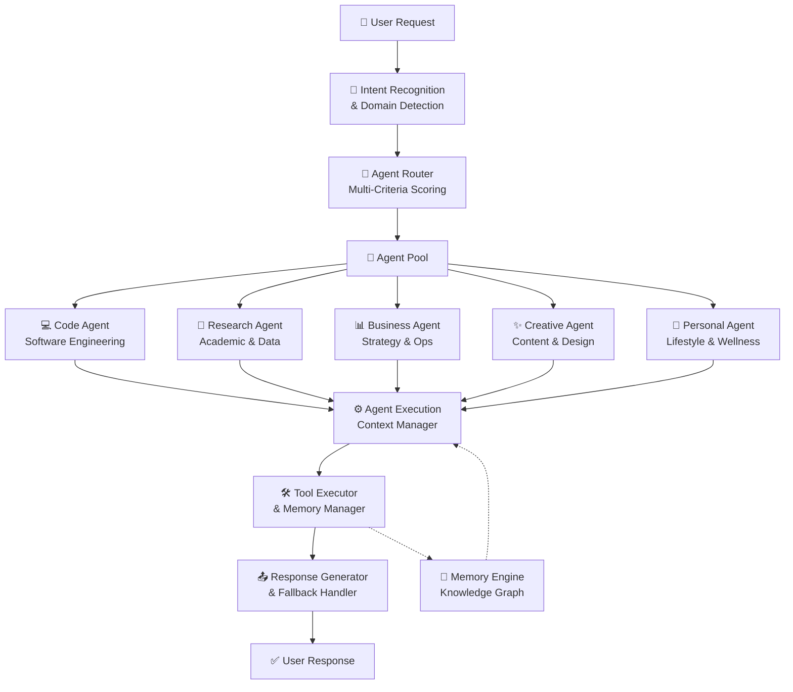
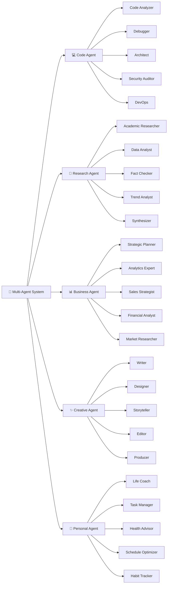
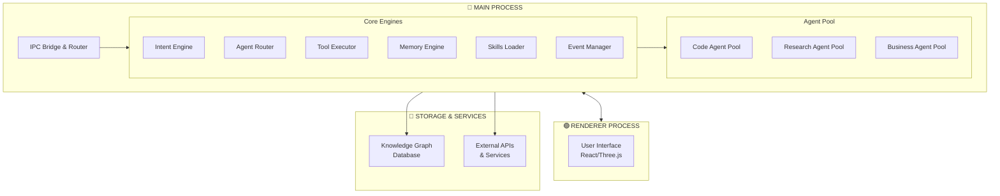
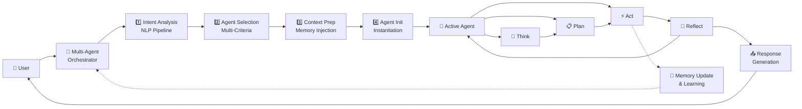
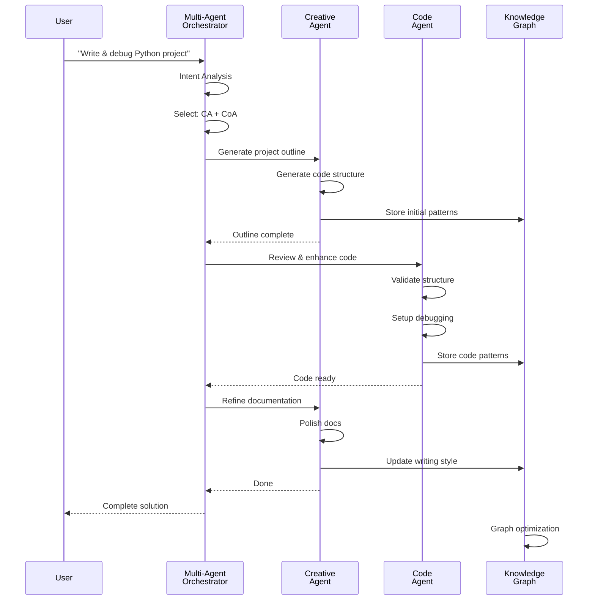
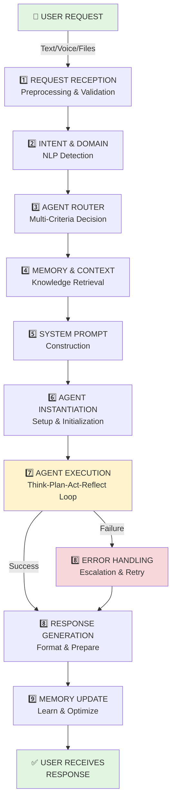
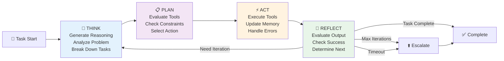
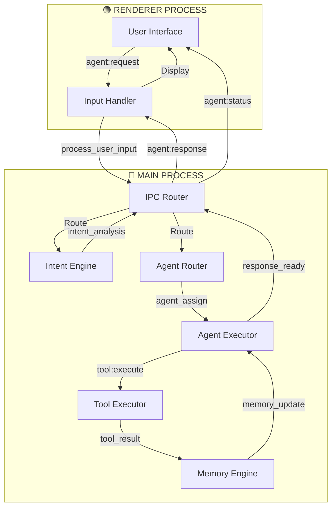
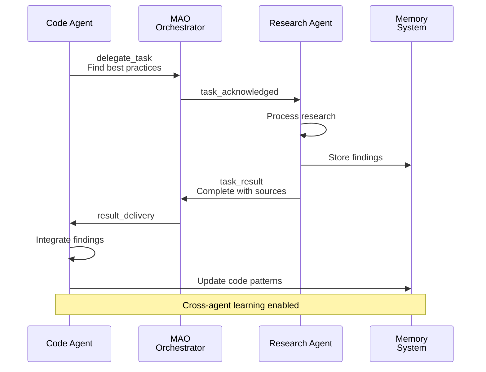

# ☀️ Project Summer: Jarvis-Class Personal AI Assistant with Agentic Orchestration

[](https://www.electronjs.org/)
[](https://deepmind.google/technologies/gemini/)
[](#-advanced-memory-intelligence-tier-2)
[](#-agentic-orchestration-system)
[](#-os--deep-app-control)
[](#-project-structure)

**Summer** is a sophisticated, state-of-the-art AI assistant built on Electron, designed to bridge the gap between human intent and machine execution. Inspired by the "Jarvis" aesthetic, Summer now features **advanced memory extensions with audio processing, procedural behavior tracking, and temporal timeline visualization** for enhanced contextual awareness and learning.

**Latest Updates (June 2026)**: 
✨ **Cortex Engine, Unified HUD Overlay, & Advanced Google Workspace Integrations**
- 🧠 **Autonomous Cortex Engine**: Self-evolution framework featuring automatic gap detection from session logs, sandboxed AST validation, dynamic Tier 1 skill forging, staging lifecycle management, and Git harvesting for PR automation.
- 📺 **Unified Transparent Overlay**: Replaced individual panel windows with a single, full-screen transparent web canvas, featuring a priority-based, content-aware 3-zone tiling layout engine and click-through pointer watchdog logic.
- 👥 **Multiple Google Accounts**: Direct listing, OAuth registration, and context-aware execution across multiple Gmail and Workspace accounts, backed by Supabase cloud state synchronization.
- 📄 **Drive Presentation & Rendering**: Dynamic HUD presentation of Drive media files, mini-browser rendering of PDFs and presentations, and silent background text-extraction.
- 🕵️ **Core Agents (Tier 2 Plugins)**: Integrated Fact Checker (web cross-referencing and PDF compilation via Playwright), News Monitor (sentiment and image scraping), and Trend Analyzer (keyword momentum and recommendation dashboards).
- ✕ **Agent Cancellation**: Seamless execution termination via direct HUD abort interaction, killing background child processes cleanly.
- 📱 **iOS Client MVVM Overhaul**: Swift architecture rewrite using modern MVVM, SwiftUI view components, voice orb integration, and visual memory graph.

---

## 📋 Table of Contents

1. [Vision & Innovation](#-vision--innovation)
2. [Core Features](#-core-features)
3. [Advanced Memory Intelligence](#-advanced-memory-intelligence-tier-2)
4. [Agentic Orchestration System](#-agentic-orchestration-system)
5. [Technical Architecture](#-technical-architecture)
6. [Agent Architecture & Orchestration Diagrams](#-agent-architecture--orchestration-diagrams)
7. [System Implementation Flow](#-system-implementation-flow)
8. [Data Flow & Communication Patterns](#-data-flow--communication-patterns)
9. [Capabilities & Integration](#-capabilities--integration)
10. [June 2026 System Upgrades](#-june-2026-system-upgrades)
11. [Project Structure](#-project-structure)
12. [Installation & Setup](#-installation--setup)
13. [Security & Privacy](#-security--privacy)
14. [Roadmap](#-roadmap)

---

## 🚀 Vision & Innovation

Summer transcends traditional chatbot limitations by introducing a **Dynamic Agent Orchestration Framework** that enables:

- **Multi-Domain Expertise**: Different specialized agents for coding, research, business, creative work, and more
- **Contextual Agent Selection**: Automatic agent activation based on user intent and domain
- **Agent Collaboration**: Agents can work together, delegate tasks, and share context
- **Persistent Learning**: Agents learn from interactions and improve over time
- **Fallback & Escalation**: Graceful degradation and escalation between agents and domains

---

## ⭐ Core Features

### 1. **Multi-Domain Agentic System**
   - Code-specific agents (Software Engineer, DevOps, Security)
   - Research agents (Academic, Data Analysis, Fact Verification)
   - Business agents (Strategy, Analytics, Sales)
   - Creative agents (Writer, Designer, Storyteller)
   - Personal agents (Life Coach, Task Manager, Health Advisor)
   - **NEW**: Persistent background agent status tracking and milestone notifications

### 2. **Intelligent Agent Router**
   - Natural language intent detection
   - Domain classification with confidence scoring
   - Agent selection algorithm with fallback strategies
   - Context preservation across agent transitions

### 3. **Advanced Memory Intelligence**
   - Ego-Aware Knowledge Graph with 360° user understanding
   - Agent-specific memory partitions
   - Cross-agent learning and context sharing
   - Semantic knowledge extraction and graph optimization
   - Audio processing extensions for voice-based memory capture
   - Procedural behavior tracking for pattern recognition
   - Temporal timeline visualization for historical context
   - **NEW**: Semantic vector search using pgvector and embeddings pipeline

### 4. **Holographic Jarvis Experience**
   - Glassmorphic UI with Three.js visualizations
   - Audio-reactive core with real-time WebGL rendering
   - Wake-word activation and hands-free interaction
   - Proactive imagery and environmental awareness
   - **NEW**: Media and file presentation system with dynamic HUD widgets (`custom_html` support)
   - **NEW**: Voice persona selection and enhanced emotional responsiveness

### 5. **Deep OS Integration**
   - System control and diagnostics
   - File management and media control
   - Communication automation
   - Productivity tools and app integration

### 6. **Visual Browser & Automation**
   - Autonomous web navigation
   - Form filling and data extraction
   - Human-in-the-loop oversight
   - Multi-tab workflow support

---

## 🧠 Advanced Memory Intelligence (Tier 2)

Unlike traditional chatbots, Summer features a persistent, **Ego-Aware Knowledge Graph** that serves as her long-term brain.

### Memory Architecture

```mermaid
graph TD
    A["User Knowledge Graph"] --> B["User Self Node<br/>Ego-Aware Center"]
    A --> C["Episodic Memory<br/>Time-Series"]
    A --> D["Semantic Memory<br/>Knowledge Base"]
    A --> E["Procedural Memory"]
    A --> F["Contextual Relationships"]
    
    B --> B1["Identity"]
    B --> B2["Skills & Expertise"]
    B --> B3["Projects & Initiatives"]
    B --> B4["Preferences & Values"]
    
    B1 --> B1a["Name, Age, Location"]
    B1 --> B1b["Personality Traits"]
    B1 --> B1c["Life Stage & Goals"]
    
    C --> C1["Conversations & Interactions"]
    C --> C2["Events & Milestones"]
    C --> C3["Decisions Made"]
    C --> C4["Lessons Learned"]
    
    D --> D1["General Knowledge"]
    D --> D2["Domain-Specific Knowledge"]
    D --> D3["Factual Information"]
    D --> D4["Conceptual Relationships"]
    
    E --> E1["How-To Guides"]
    E --> E2["Workflow Patterns"]
    E --> E3["Automation Scripts"]
    E --> E4["Best Practices"]
    
    F --> F1["People & Organizations"]
    F --> F2["Projects & Goals"]
    F --> F3["Resources & Tools"]
    F --> F4["Temporal Connections"]
```



### Key Memory Features

- **Ego-Awareness**: A specialized `user_self` node structure that separates your personal identity, skills, and projects from general world knowledge.
- **Importance-Based Context**: Every memory node has an importance score (0.0–1.0). High-priority facts (★5/5) are "pinned" directly to Summer's system instruction, while peripheral data is stored in the graph.
- **Semantic Chunking**: Documents (PDF, Text) and web pages are processed using intelligent context boundaries rather than arbitrary character limits, ensuring high-fidelity knowledge extraction.
- **Visual Memory Recall**: Gemini Vision analyzes your uploaded photos, storing them with descriptive tags. Summer can proactively "show" you your own photos when the conversation turns personal.
- **Session Diary**: At the end of every session, Summer generates a "diary entry" to maintain emotional and task continuity across days and weeks.
- **Graph Optimization**: Built-in AI routines to auto-connect disparate memory "islands" and resolve factual contradictions.
- **Agent-Specific Partitions**: Each agent maintains its own memory partition while accessing shared contextual knowledge.
- **Audio Processing Extensions**: Capture and process voice-based interactions for enhanced memory contextualization.
- **Procedural Behavior Tracking**: Monitor and learn from procedural patterns in user interactions.
- **Temporal Timeline Visualization**: Visual representation of memory evolution and temporal relationships.
- **Semantic Vector Search**: Advanced knowledge retrieval powered by pgvector and embeddings pipeline.

---

## 🤖 Agentic Orchestration System

### **The Ultimate Plan: Multi-Agent Orchestration Framework**

Summer's agentic capabilities represent a paradigm shift from single-model assistance to a **dynamic, self-organizing agent collective**. This system enables Summer to behave as different specialized experts, seamlessly delegating, collaborating, and learning across domains.

### Orchestration Architecture Overview



### Specialized Agent Hierarchy



---

## 🏗️ Technical Architecture

### Main System Architecture



### Agent Lifecycle State Machine

```mermaid
stateDiagram-v2
    [*] --> IDLE
    
    IDLE --> INITIALIZING: Activation Signal
    INITIALIZING --> ANALYZING: Setup Complete
    
    ANALYZING --> PLANNING: Analysis Done
    PLANNING --> EXECUTING: Plan Ready
    EXECUTING --> REFLECTING: Action Complete
    
    REFLECTING --> ANALYZING: Retry
    REFLECTING --> FINALIZING: Success/Fail Decision
    
    FINALIZING --> IDLE: Complete/Timeout
    
    note right of REFLECTING
        Evaluate output
        Check criteria
        Determine next step
    end
```

---

## 📊 Agent Architecture & Orchestration Diagrams

### Agent Communication & Data Flow



### Multi-Agent Collaboration Pattern



---

## 🔄 System Implementation Flow

### Complete Request-to-Response Pipeline



### Agent Execution Loop - Think-Plan-Act-Reflect



---

## 📡 Data Flow & Communication Patterns

### IPC Message Flow



### Agent-to-Agent Collaboration Protocol



---

## 🛠️ Capabilities & Integration

### 🖥️ OS & Deep App Control

Summer has "fingers" on your machine. She can:

- **System Control**: Manage volume, brightness, DND mode, dark/light mode, and sleep/lock.
- **Diagnostics**: Read CPU, RAM, disk, and battery status; identify resource-heavy processes.
- **File Management**: Open files, search via Finder, and empty the Trash.
- **Communication**: Send messages via WhatsApp and manage system notifications.
- **Media**: Control Spotify/Music playback and volume.
- **Productivity**: Full control over Clipboard, Screenshots, and Timers.

### 🌐 Visual Browser (Interactive UI)

When background research isn't enough, Summer can open a **visible mini-browser** on your screen:

- **Autonomous Navigation**: She can navigate, read page content (Accessibility-aware), click buttons, and type into forms.
- **Human-in-the-loop**: You can watch her work or take over if needed.
- **Tab Management**: Support for multiple tabs and complex workflows like Google Login.

### 📅 Google Workspace Integration

Deep, authenticated access to your Google ecosystem:

- **Calendar**: Fetch your daily schedule and inject it into your morning briefing.
- **Drive/Mail/Maps**: Tools to interact with your files, emails, and location-based data.

### 🤖 Multi-Agent Tools Capability Map

```mermaid
graph LR
    subgraph Tools["🛠️ TOOL ECOSYSTEM"]
        Git["Git Integration"]
        Code["Code Analysis"]
        Debug["Debugger"]
        Web["Web Scraper"]
        API["API Clients"]
        CRM["CRM Integration"]
        Finance["Financial Tools"]
        Calendar["Calendar API"]
        Health["Health Data"]
    end
    
    subgraph Agents["🤖 AGENTS"]
        CA["Code Agent"]
        RA["Research Agent"]
        BA["Business Agent"]
        CRA["Creative Agent"]
        PA["Personal Agent"]
    end
    
    Git --> CA
    Code --> CA
    Debug --> CA
    
    Web --> RA
    API --> RA
    
    CRM --> BA
    Finance --> BA
    
    Calendar --> PA
    Health --> PA
    
    style CA fill:#b3e5fc
    style RA fill:#c8e6c9
    style BA fill:#ffe0b2
    style CRA fill:#f0e6ff
    style PA fill:#ffccbc

---

## 🌟 June 2026 System Upgrades

### 1. Unified Transparent Overlay & Tiling Layout Engine
Replaced individual panel window instances with a single, high-performance, full-screen transparent Electron canvas:
* **Unified Canvas**: Controlled via [overlay.html](file:///Users/ayushjaiswal/Desktop/project-summer%20copy%202/src/overlay/overlay.html), powered by [overlay-renderer.js](file:///Users/ayushjaiswal/Desktop/project-summer%20copy%202/src/overlay/overlay-renderer.js) and [overlay-preload.js](file:///Users/ayushjaiswal/Desktop/project-summer%20copy%202/src/overlay/overlay-preload.js).
* **Smart Pointer Capture & Watchdog**: Solves pointer blocking. The window ignores mouse events (`setIgnoreMouseEvents(true, { forward: true })`) to pass clicks through to the OS. Mouse capture is enabled dynamically when hovering over widgets. A 500ms watchdog timer monitors cursor positions, automatically restoring click-through if a layout change or widget closure leaves the mouse over empty space.
* **3-Zone Tiling Layout Engine**: Dynamic, content-aware widget arrangement. The active/focused widget (such as [mermaid](file:///Users/ayushjaiswal/Desktop/project-summer%20copy%202/src/overlay/overlay-renderer.js#L231-L257) diagrams, emails, custom html) is centered with custom width and height. Secondary widgets automatically tile in left and right columns (max 8 visible, excess sent off-screen).
* **Modular Multi-Window Orchestration**: Managed by [window-manager.js](file:///Users/ayushjaiswal/Desktop/project-summer%20copy%202/src/main/window-manager.js) and [windows.js](file:///Users/ayushjaiswal/Desktop/project-summer%20copy%202/src/main/windows.js).
  * *Floating Orb Window*: The core voice responder (shifts to the left when the browser opens, recenters when closed).
  * *On-Demand Mini-Browser Window*: Built-in browser taking 50% of screen width for web tools and authentication.
  * *Settings/Permissions Window*: Local configurations and OAuth setup.

### 2. Autonomous Cortex Engine (Self-Evolution Loop)
An automated background capability optimizer that wakes up when all clients disconnect (idle mode):
* **Core Loop Orchestration**: Regulated by [cortex-engine.js](file:///Users/ayushjaiswal/Desktop/project-summer%20copy%202/src/cortex/cortex-engine.js). Runs sequential cycles governed by strict daily token limits (100k tokens/day) and automatic client connection gates.
* **Evolution Subsystems**:
  * **Memory Consolidator** ([memory-consolidator.js](file:///Users/ayushjaiswal/Desktop/project-summer%20copy%202/src/cortex/memory-consolidator.js)): Prunes knowledge graphs and merges related nodes.
  * **Gap Detector** ([gap-detector.js](file:///Users/ayushjaiswal/Desktop/project-summer%20copy%202/src/cortex/gap-detector.js)): Mines session diaries and user-correction anti-patterns for failure items, writing `CapabilityGap` nodes to the graph.
  * **Skill Forge** ([skill-forge.js](file:///Users/ayushjaiswal/Desktop/project-summer%20copy%202/src/cortex/skill-forge.js)): Generates context-only JavaScript skills (Tier 1) containing expert guidance.
  * **Sandbox Validator (Security Gate)** ([sandbox-validator.js](file:///Users/ayushjaiswal/Desktop/project-summer%20copy%202/src/cortex/sandbox-validator.js)): Enforces a strict security policy on generated code via Node.js `vm` AST validation. Blocks `require`, `import`, `eval`, Node globals (`process`, `global`), networking/IO, and functions, ensuring context is pure data.
  * **Staging Registry** ([staging-registry.js](file:///Users/ayushjaiswal/Desktop/project-summer%20copy%202/src/cortex/staging-registry.js)): Hot-reloads and registers skills. Auto-promotes skills after 3 successful executions; auto-demotes and deletes them after 2 failures.
  * **Git Harvester** ([git-harvester.js](file:///Users/ayushjaiswal/Desktop/project-summer%20copy%202/src/cortex/git-harvester.js)): Automatically packages promoted skills and opens GitHub Pull Requests to merge them.
  * **Self-Reflector** ([self-reflector.js](file:///Users/ayushjaiswal/Desktop/project-summer%20copy%202/src/cortex/self-reflector.js)): Generates daily journals detailing capabilities evolution.

### 3. Multiple Google Accounts & Drive Presentation
Extends Google Workspace capabilities with multi-account auth and media streaming:
* **Multi-Account Storage**: Managed in [google-auth.js](file:///Users/ayushjaiswal/Desktop/project-summer%20copy%202/src/auth/google-auth.js). Migrated from legacy single-token files to `google-accounts.json`, supporting concurrent accounts and primary selection.
* **Workspace Tools Context**: Registered in [google-tools.js](file:///Users/ayushjaiswal/Desktop/project-summer%20copy%202/src/tools/google-tools.js) and executed by [drive-service.js](file:///Users/ayushjaiswal/Desktop/project-summer%20copy%202/src/services/drive-service.js) and [mail-service.js](file:///Users/ayushjaiswal/Desktop/project-summer%20copy%202/src/services/mail-service.js). Supports querying, listing, and archiving across all accounts at once.
* **Drive Media Streaming & Processing**:
  * Playback of media files on the HUD (images rendered in overlay, videos and audio opened in the browser window).
  * Integrates silent PDF text-extraction using `pdf-parse` to feed document contents into Gemini's context for live Q&A.
* **Supabase Cloud Syncing**: Synchronizes credentials and settings to Supabase table `app_settings` for seamless multi-device access.

### 4. New Core Agents (Tier 2 Plugins)
Introduces specialized background worker agents loaded dynamically via [orchestrator.js](file:///Users/ayushjaiswal/Desktop/project-summer%20copy%202/src/orchestration/orchestrator.js):
* **Fact Checker** ([fact_checker/index.js](file:///Users/ayushjaiswal/Desktop/project-summer%20copy%202/plugins/fact_checker/index.js)): Evaluates claims by scanning search indexes, outputs color-coded "Truth-O-Meter" verdicts, renders a report via Playwright chromium, compiles it to PDF, and uploads it to Google Drive.
* **News Monitor** ([news_monitor/index.js](file:///Users/ayushjaiswal/Desktop/project-summer%20copy%202/plugins/news_monitor/index.js)): Gathers news items, performs sentiment analysis, scrapes lead images from og:image tags, and generates custom glassmorphic dashboards.
* **Trend Analyzer** ([trend_analyzer/index.js](file:///Users/ayushjaiswal/Desktop/project-summer%20copy%202/plugins/trend_analyzer/index.js)): Analyzes keyword popularity, graphs trend momentum, and structures recommendation dashboards.

### 5. Agent Cancellation Workflow
Provides users the ability to abort active background agents instantly:
* **Protocol & IPC Routing**: Employs `cancel_agents` message type in [protocol.js](file:///Users/ayushjaiswal/Desktop/project-summer%20copy%202/src/core/transport/protocol.js) routed through [daemon-client.js](file:///Users/ayushjaiswal/Desktop/project-summer%20copy%202/src/main/daemon-client.js) and [session-ipc.js](file:///Users/ayushjaiswal/Desktop/project-summer%20copy%202/src/main/ipc/session-ipc.js).
* **Process Termination**: Handled in [ws-server.js](file:///Users/ayushjaiswal/Desktop/project-summer%20copy%202/src/core/transport/ws-server.js) and [orchestrator.js](file:///Users/ayushjaiswal/Desktop/project-summer%20copy%202/src/orchestration/orchestrator.js). Kills spawned child processes immediately, updates status, and closes the progress panel.

### 6. iOS Client MVVM Overhaul
Complete refactoring of the Swift mobile application located in [clients/ios/SummerApp/](file:///Users/ayushjaiswal/Desktop/project-summer%20copy%202/clients/ios/SummerApp/):
* **Architecture Shift**: Transitioned to SwiftUI and clean MVVM using [SummerViewModel.swift](file:///Users/ayushjaiswal/Desktop/project-summer%20copy%202/clients/ios/SummerApp/SummerApp/ViewModels/SummerViewModel.swift) and [MemoryViewModel.swift](file:///Users/ayushjaiswal/Desktop/project-summer%20copy%202/clients/ios/SummerApp/SummerApp/ViewModels/MemoryViewModel.swift).
* **Interface Improvements**: Includes `ChatView.swift` for interactive messaging, `VoiceOrbView.swift` representing voice activity, and `MemoryGraphView.swift` which reads memory nodes and visualizes connections directly on iOS.

---


## 🔧 Installation & Setup

### Prerequisites

- **Node.js** v18+ and **npm** v9+
- **Electron** v41.5.0+
- **Google Gemini API Key** (for AI capabilities)
- **macOS** (for native integrations)

### Quick Start

```bash
# Clone the repository
git clone https://github.com/Ayushkumar0602/summer-personal-assistant-.git
cd summer-personal-assistant

# Install dependencies
npm install

# Build the project
npm run build

# Start development server
npm run dev

# Package for production
npm run package
```

### Configuration

Create a `.env` file in the root directory:

```
GEMINI_API_KEY=your_api_key_here
LOG_LEVEL=info
MEMORY_DB_PATH=./data/memory
AUDIO_PROCESSING_ENABLED=true
PROCEDURAL_TRACKING_ENABLED=true
TIMELINE_VISUALIZATION_ENABLED=true
```

---

## 🔐 Security & Privacy

- **End-to-End Encryption**: All sensitive data is encrypted at rest and in transit.
- **Local-First**: Most processing happens locally; minimal data sent to APIs.
- **User Consent**: Explicit opt-in for data collection and processing.
- **Audit Logs**: Comprehensive logging of all agent actions for transparency.
- **Sandboxing**: Agents execute in isolated contexts with permission restrictions.

---

## 🗺️ Roadmap

### Phase 1: Foundation (Current)
- ✅ Multi-agent orchestration system
- ✅ Advanced memory with audio extensions
- ✅ Procedural behavior tracking
- ✅ Temporal timeline visualization
- ⏳ Core agent implementations

### Phase 2: Enhancement
- [ ] Cross-platform support (Windows, Linux)
- [ ] Advanced voice interaction
- [ ] Improved visual browser automation
- [ ] Real-time collaboration features
- [ ] Mobile companion app

### Phase 3: Intelligence
- [ ] Federated learning across devices
- [ ] Advanced predictive capabilities
- [ ] Proactive assistance system
- [ ] Emotional intelligence layer
- [ ] Long-term goal tracking

### Phase 4: Ecosystem
- [ ] Third-party agent marketplace
- [ ] Custom skill development framework
- [ ] Community contributions system
- [ ] Enterprise deployment options
- [ ] Multi-user organizations support

---

## 📝 License

This project is licensed under the MIT License – see the [LICENSE](LICENSE) file for details.

---

## 🤝 Contributing

Contributions are welcome! Please read [CONTRIBUTING.md](CONTRIBUTING.md) for guidelines on how to contribute, report issues, and submit pull requests.

---

## 💬 Support & Community

- **Documentation**: [Project Wiki](https://github.com/Ayushkumar0602/summer-personal-assistant-/wiki)
- **Issues**: [GitHub Issues](https://github.com/Ayushkumar0602/summer-personal-assistant-/issues)
- **Discussions**: [GitHub Discussions](https://github.com/Ayushkumar0602/summer-personal-assistant-/discussions)
- **Contact**: Reach out via GitHub or email

---

**Made with ❤️ by Ayushkumar0602**
