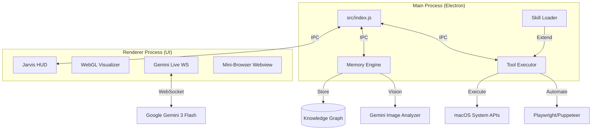

# ☀️ Project Summer: Jarvis-Class Personal AI Assistant

[](https://www.electronjs.org/)
[](https://deepmind.google/technologies/gemini/)
[](#-advanced-memory-intelligence-tier-2)
[](#-os--deep-app-control)

**Summer** is a sophisticated, state-of-the-art AI assistant built on Electron, designed to bridge the gap between human intent and machine execution. Inspired by the "Jarvis" aesthetic, Summer is an autonomous agent that manages your digital life, remembers your preferences through an advanced Knowledge Graph, and controls your environment with precision.

---

## 🧠 Advanced Memory Intelligence (Tier 2)

Unlike traditional chatbots, Summer features a persistent, **Ego-Aware Knowledge Graph** that serves as her long-term brain.

- **Ego-Awareness**: A specialized `user_self` node structure that separates your personal identity, skills, and projects from general world knowledge.
- **Importance-Based Context**: Every memory node has an importance score (0.0–1.0). High-priority facts (★5/5) are "pinned" directly to Summer's system instruction, while peripheral data is retrieved dynamically via the `query_memory` tool.
- **Semantic Chunking**: Documents (PDF, Text) and web pages are processed using intelligent context boundaries rather than arbitrary character limits, ensuring high-fidelity knowledge extraction.
- **Visual Memory Recall**: Gemini Vision analyzes your uploaded photos, storing them with descriptive tags. Summer can proactively "show" you your own photos when the conversation turns personal.
- **Session Diary**: At the end of every session, Summer generates a "diary entry" to maintain emotional and task continuity across days and weeks.
- **Graph Optimization**: Built-in AI routines to auto-connect disparate memory "islands" and resolve factual contradictions.

---

## 🎭 The "Jarvis" Experience

Summer is designed to be a "living" presence in your workspace:

- **Holographic HUD**: A premium, glassmorphic UI featuring vibrant gradients, Three.js-powered visualizers, and dynamic micro-animations.
- **Audio-Reactive Core**: Real-time WebGL visualization of voice interactions, creating a futuristic "Jarvis" feel.
- **Wake-Word Activation**: Integrated listening for "Summer, wake up" to enable completely hands-free interaction.
- **Proactive Imagery**: Summer doesn't just talk; she *shows*. She proactively displays relevant personal photos or web images on the HUD to accompany her responses.
- **Environmental Awareness**: On startup, Summer automatically injects your local weather, time, and location into the session context.

---

## 🛠️ Capabilities & Integration

### 🖥️ OS & Deep App Control
Summer has "fingers" on your machine. She can:
- **System Control**: Manage volume, brightness, DND mode, dark/light mode, and sleep/lock.
- **Diagnostics**: Read CPU, RAM, disk, and battery status; identify resource-heavy processes.
- **File Management**: Open files, search via Finder, and empty the Trash.
- **Communication**: Send messages via WhatsApp and manage system notifications.
- **Media**: Control Spotify/Music playback and volume.
- **Productivity**: Full control over Clipboard, Screenshots, and Timers.

### 🌐 Visual Browser (Interactive UI)
When background research isn't enough, Summer can open a **visible mini-browser** on your screen:
- **Autonomous Navigation**: She can navigate, read page content (Accessibility-aware), click buttons, and type into forms.
- **Human-in-the-loop**: You can watch her work or take over if needed.
- **Tab Management**: Support for multiple tabs and complex workflows like Google Login.

### 📅 Google Workspace Integration
Deep, authenticated access to your Google ecosystem:
- **Calendar**: Fetch your daily schedule and inject it into your morning briefing.
- **Drive/Mail/Maps**: Tools to interact with your files, emails, and location-based data.

---

## 🏗️ Technical Architecture



- **Main Process**: Handles window lifecycles, security permissions, IPC routing, and tool execution logic.
- **Memory Engine**: Manages the D3-compatible graph structure, semantic extraction, and diary summarization.
- **Skill System**: A modular directory (`src/skills/`) that allows adding new capabilities (e.g., WhatsApp, AirDrop) without modifying the core engine.
- **Visualizer**: Uses `Three.js` and Web Audio API for reactive holographic effects.

---

## 📂 Project Structure

```text
├── src/
│   ├── index.js             # Entry point: Main Electron process
│   ├── renderer.js          # Core UI logic & Voice interaction
│   ├── visualizer.js        # Three.js holographic visualizer logic
│   ├── knowledge/           # Advanced Memory Tier
│   │   ├── graph-store.js   # JSON persistence & node management
│   │   ├── graph-extractor.js # AI-powered knowledge extraction
│   │   ├── image-analyzer.js # Gemini Vision image memory pipeline
│   │   └── session-diary.js # Daily summary & continuity logic
│   ├── skills/              # Modular capability system
│   │   ├── whatsapp-skill.js
│   │   ├── music-skill.js
│   │   └── skill-loader.js  # Dynamic skill discovery
│   ├── tools/               # LLM Tool definitions & OS execution
│   │   ├── os-tools.js      # macOS deep integration
│   │   └── web-tools.js     # Search & Scraping
│   ├── services/            # API integrations (Google, Maps, etc.)
│   └── settings/            # Permissions & User configuration UI
├── forge.config.js          # Electron Forge configuration
└── package.json             # Core dependencies & scripts
```

---

## 🔧 Installation & Setup

### Prerequisites
- **Node.js**: v18.x or higher.
- **OS**: Optimized for macOS (many tools use `systemPreferences` and `applescript`).
- **Google Cloud**: A Gemini API Key is required. For Workspace features, a `credentials.json` is needed.

### Steps
1. **Clone & Install**:
   ```bash
   git clone https://github.com/your-username/project-summer.git
   cd project-summer
   npm install
   ```

2. **Environment Setup**:
   Create a `.env` file:
   ```env
   GOOGLE_API_KEY=your_key_here
   LOCATION_API_KEY=your_ipinfo_key_here
   NEWS_API_KEY=your_newsapi_key_here
   ```

3. **Launch**:
   ```bash
   npm start
   ```

---

## 🛡️ Security & Privacy

- **Permissions System**: Fine-grained control over which tools Summer can use. You can revoke access to the clipboard, system settings, or browser at any time via the Settings UI.
- **Audit Logs**: Every OS-level action (e.g., "Set volume to 50%") is logged locally for your review.
- **Confirmation Dialogs**: Destructive actions (Quit App, Empty Trash, System Sleep) require a manual UI confirmation before execution.
- **Local Data**: Your Knowledge Graph and Image Memory are stored locally on your machine, not in the cloud.

---

## 🗺️ Roadmap

- [ ] **Tier 3 Memory**: Integration of vector DBs for RAG over massive local datasets.
- [ ] **Cross-Platform**: Windows system control parity.
- [ ] **Real-time Video**: Enabling "Vision" via webcam for physical environment awareness.
- [ ] **Offline LLM**: Support for local models (Llama 3) for basic offline tasks.

---

## 📄 License
This project is licensed under the MIT License - see the [LICENSE](LICENSE) file for details.

---

*“I am Summer. How can I assist you today?”*
