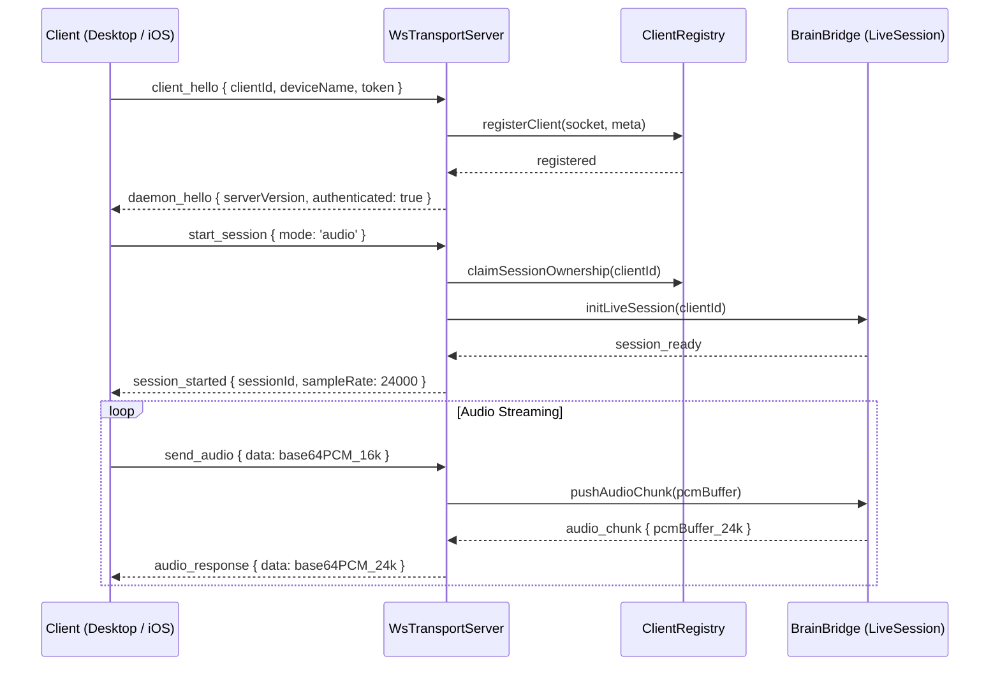
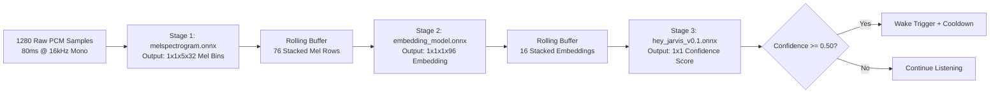
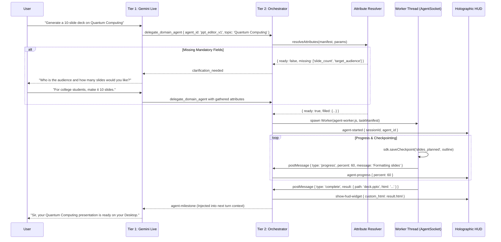
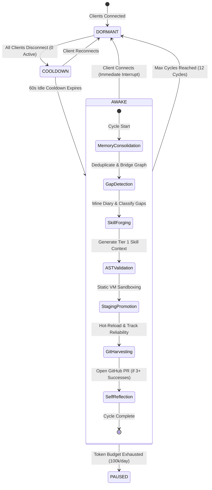
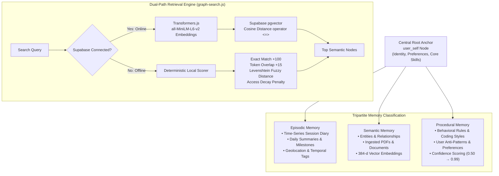

# Project Summer: Local-First Autonomous Personal AI Assistant

[](https://nodejs.org/)
[](https://www.electronjs.org/)
[](https://ai.google.dev/)
[](https://onnxruntime.ai/)
[](https://huggingface.co/docs/transformers.js)
[](https://supabase.com/)
[](https://playwright.dev/)
[](https://threejs.org/)
[](LICENSE)

**Project Summer** is an open-source, local-first personal AI assistant engineered for deep operating system automation, conversational fluidity, and persistent learning. Built on Node.js and Electron, Summer pairs low-latency bidirectional voice streaming via Google Gemini Live with a decoupled, headless background daemon architecture.

Summer operates as a two-tier intelligence platform: a front-line conversational session handles real-time dialogue and intent dispatching, while heavy asynchronous tasks (deep web research, presentation authoring, fact checking) execute in isolated worker threads with state checkpointing. When idle, an autonomous subconscious engine audits session logs for capability gaps, writes new context skills, validates them through static AST sandboxing, and automatically proposes pull requests to its own codebase.

---

## 📋 Table of Contents

1. [Technology Stack Matrix](#-technology-stack-matrix)
2. [Master System Architecture](#-master-system-architecture)
3. [Deep Documentation Library](#-deep-documentation-library)
4. [Subsystem Deep Dives & Mechanics](#-subsystem-deep-dives--mechanics)
   - [4.1 Headless Core Daemon & Wire Protocol](#41-headless-core-daemon--wire-protocol)
   - [4.2 Voice Pipeline & Acoustic Streaming](#42-voice-pipeline--acoustic-streaming)
   - [4.3 Two-Tier Agent Orchestration & Worker Threads](#43-two-tier-agent-orchestration--worker-threads)
   - [4.4 Autonomous Self-Evolution Engine (Cortex)](#44-autonomous-self-evolution-engine-cortex)
   - [4.5 Cognitive Memory & Ego-Aware Knowledge Graph](#45-cognitive-memory--ego-aware-knowledge-graph)
   - [4.6 Operating System & Deep In-App Control](#46-operating-system--deep-in-app-control)
   - [4.7 CDP Browser Automation](#47-cdp-browser-automation)
   - [4.8 Holographic HUD & Pointer Watchdog Engine](#48-holographic-hud--pointer-watchdog-engine)
5. [Verified Domain Agent Plugins](#-verified-domain-agent-plugins)
6. [Repository Structure](#-repository-structure)
7. [Prerequisites & System Requirements](#-prerequisites--system-requirements)
8. [Installation & Setup](#-installation--setup)
9. [Running Summer](#-running-summer)
10. [Configuration Reference (.env)](#-configuration-reference-env)
11. [Security, Sandboxing & Data Privacy](#-security-sandboxing--data-privacy)
12. [License](#-license)

---

## 🛠️ Technology Stack Matrix

Every dependency and technology in Project Summer is mapped to its concrete architectural role below:

| Technology / Library | Version / Scope | Architectural Role & Implementation Details |
| :--- | :--- | :--- |
| **Node.js** | `>=18.0.0` | Core runtime for daemon, worker threads, and CLI tools. CommonJS + ESM interoperability. |
| **Electron** | `^41.5.0` | Desktop shell managing transparent HUD windows, WebContents, IPC, and native macOS window bounds. |
| **Google Gemini Live API** | `@google/genai` `^2.10.0` | Bidirectional WebSocket audio streaming (`gemini-3.1-flash-live-preview`). Zero-latency speech-to-speech. |
| **Gemini Interactions API** | `deep-research-preview-04-2026` | Multi-step recursive research and reasoning engine used by `plugins/research_analyst/`. |
| **ONNX Runtime Node** | `onnxruntime-node` `^1.26.0` | Local CPU inference for the OpenWakeWord 3-stage keyword detection pipeline. |
| **Transformers.js** | `@xenova/transformers` `^2.17.2` | Runs `Xenova/all-MiniLM-L6-v2` locally via ONNX, producing 384-dimensional normalized vector embeddings. |
| **Supabase & pgvector** | `@supabase/supabase-js` `^2.106.0` | PostgreSQL cloud sync with `vector(384)` embeddings and cosine distance (`<=>`) RPC matching. |
| **Playwright** | `playwright` `^1.59.1` | Headless Chromium automation for PDF report compilation, fact checking, and page snapshotting. |
| **Chrome DevTools Protocol (CDP)** | Electron `debugger` | Direct inspection of Chrome's Accessibility Tree (`Accessibility.getFullAXTree`) for stable web automation. |
| **Node.js Worker Threads** | `node:worker_threads` | Process isolation for Tier 2 domain agents (`agent-socket.js`, `agent-worker.js`). |
| **Node.js VM Module** | `node:vm` | Static Abstract Syntax Tree (AST) compilation and validation for autonomous skill files (`sandbox-validator.js`). |
| **Three.js** | `three` `^0.184.0` | WebGL GPU-accelerated holographic voice orb rendering with dynamic morphing shaders. |
| **Web Audio API** | Native Browser API | `AnalyserNode` FFT real-time frequency spectrum sampling for voice audio reactivity. |
| **PptxGenJS** | `pptxgenjs` `^4.0.1` | Programmatic creation of modern PowerPoint `.pptx` presentations in `plugins/ppt_editor/`. |
| **macOS Accessibility API** | AppleScript / System Events | OS UI control: clicking native buttons, reading UI hierarchies, sending keystrokes across macOS applications. |
| **Swift & SwiftUI** | Swift 5.9+ / iOS 17+ | Native mobile client (`clients/ios/SummerApp/`) built with MVVM, Combine, and WebSockets. |
| **WebSocket** | `ws` `^8.20.0` | Transport layer between daemon and clients, implementing the custom Summer Wire Protocol. |
| **PDF Parse** | `pdf-parse` `^1.1.1` | In-memory text extraction from PDFs for knowledge graph ingestion and Google Drive previewing. |

---

## 🏗️ Master System Architecture

Project Summer decouples the central intelligence engine from the presentation clients. The **Summer Core Daemon** runs independently as a headless process, communicating with desktop and mobile clients over an authenticated WebSocket wire protocol.


```mermaid
graph TD
    subgraph Clients["PRESENTATION CLIENTS (The Body)"]
        ElectronApp["Electron Desktop Overlay\n• Unified Transparent Canvas\n• 3-Zone Tiling Engine\n• Pointer Watchdog\n• WebGL Three.js Voice Orb"]
        iOSApp["iOS Mobile App (SwiftUI)\n• SummerViewModel (MVVM)\n• VoiceOrbView\n• MemoryGraphView"]
        CLIClient["Headless CLI / Web Tools"]
    end

    ElectronApp <-->|WebSocket ws://localhost:8765\nSummer Wire Protocol| Daemon
    iOSApp      <-->|WebSocket wss://summer.local:8765\nSummer Wire Protocol| Daemon
    CLIClient   <-->|WebSocket ws://localhost:8765| Daemon

    subgraph Daemon["SUMMER CORE DAEMON (summer-daemon.js - The Brain)"]
        WsServer["WebSocket Transport Server\nsrc/core/transport/ws-server.js"]
        ClientReg["Client Registry & Session Ownership\nsrc/core/transport/client-registry.js"]
        EventBus["In-Process Event Bus\nsrc/core/event-bus.js"]
        BrainBridge["Brain Bridge\nsrc/core/brain-bridge.js"]

        WsServer <--> ClientReg
        ClientReg <--> EventBus
        EventBus <--> BrainBridge

        subgraph Tier1["TIER 1: FRONT-LINE CONVERSATIONAL BRAIN"]
            GeminiLive["Gemini Live WebSocket Client\nsrc/main/gemini/live-session.js"]
            PCMStream["16kHz / 24kHz PCM Full-Duplex Stream"]
            VAD["Voice Activity Detection & Barge-in"]
            ContextBuilder["Context Injector (Pinned Facts, Diary, Rules)"]
            ToolDispatcher["Tool Router & Gateway\nsrc/tools/tool-router.js"]
        end

        subgraph Tier2["TIER 2: UPPER LAYER ORCHESTRATION"]
            Orchestrator["Orchestrator\nsrc/orchestration/orchestrator.js"]
            AttrResolver["Attribute Resolver (Gathering State)"]
            AgentSocket["Agent Socket Pool\nsrc/orchestration/agent-socket.js"]
            EnvPolicy["Environment Policy Whitelist"]
            SDKBridge["AgentSDK IPC Bridge & Checkpoint Proxy"]
        end

        subgraph Workers["WORKER THREAD ISOLATION (plugins/)"]
            WorkerPPT["PPT Editor Agent\npptxgenjs + Layout Engine"]
            WorkerResearch["Deep Research Analyst\nInteractions API + Playwright"]
            WorkerFact["Fact Checker Agent\nWeb Scraping + Verdict Matrix"]
            WorkerNews["News Monitor Agent\nRSS + Sentiment Analysis"]
            WorkerTrend["Trend Analyzer Agent\nKeyword Momentum + HTML Charts"]
        end

        subgraph Cortex["AUTONOMOUS CORTEX ENGINE (IDLE SUBCONSCIOUS)"]
            CortexEngine["Cortex State Machine\nsrc/cortex/cortex-engine.js"]
            GapDetector["Gap Detector (Mines Diary & Logs)"]
            SkillForge["Skill Forge (Tier 1 Code Generator)"]
            ASTSandbox["Sandbox Validator (node:vm AST Security)"]
            Staging["Staging Registry (Lifecycle Tracker)"]
            GitHarvester["Git Harvester (Automated GitHub PRs)"]
            SelfReflector["Self-Reflector (Meta-Analysis Journal)"]
        end

        subgraph Knowledge["KNOWLEDGE & PERSISTENCE LAYER"]
            GraphStore["Ego-Aware Knowledge Graph (DAG)\nuser_self Anchor Node"]
            LocalEmbeddings["Transformers.js (all-MiniLM-L6-v2)\n384-d Local Vectors"]
            SupabaseVector["Supabase pgvector (Cloud Cosine Search)"]
            SessionDiary["Autobiographical Session Diary"]
            ProceduralMem["Procedural Habit & Rule Memory"]
        end

        BrainBridge <--> GeminiLive
        BrainBridge <--> Orchestrator
        EventBus <--> CortexEngine

        GeminiLive <--> ToolDispatcher
        ToolDispatcher -->|delegate_domain_agent| Orchestrator

        Orchestrator --> AttrResolver
        AttrResolver --> AgentSocket
        AgentSocket --> EnvPolicy
        EnvPolicy --> Workers
        Workers <--> SDKBridge

        GeminiLive <--> Knowledge
        CortexEngine <--> Knowledge
    end
```

---

## 📚 Deep Documentation Library

Project Summer includes exhaustive architectural deep-dives for every major subsystem, located in [`docs/`](./docs/):

| Subsystem / Topic | Dedicated Architecture Document | Key Topics Covered |
| :--- | :--- | :--- |
| **System Audit & Claims** | [README Claims Technical Audit](./docs/README_CLAIMS_TECHNICAL_AUDIT.md) | Line-by-line verification of all advertised claims, source code references, and invariants. |
| **Autonomous Evolution** | [Autonomous Evolution & Self-Improvement](./docs/AUTONOMOUS_EVOLUTION_AND_SELF_IMPROVEMENT.md) | Cortex Engine, Gap Detector, Skill Forge, AST Sandboxing, Staging Registry & Git PR automation. |
| **Multi-Agent Orchestration** | [Multi-Agent Orchestration & Workers](./docs/MULTI_AGENT_ORCHESTRATION_AND_WORKERS.md) | Two-Tier architecture, Socket & Plug model, worker threads, AgentSDK & Checkpointing. |
| **Advanced Memory Engine** | [Advanced Memory & Knowledge Graphs](./docs/ADVANCED_MEMORY_AND_KNOWLEDGE_GRAPH.md) | Ego-aware `user_self` graph, Xenova 384-d embeddings, pgvector cosine search, procedural memory. |
| **OS & Desktop Control** | [OS Integration & System Control](./docs/OS_INTEGRATION_AND_SYSTEM_CONTROL.md) | Native macOS tools, Vision & Accessibility hands, Zero-trust permissions, Audit logging. |
| **Browser Automation** | [Browser Automation & Tool Calling](./docs/BROWSER_AUTOMATION_AND_TOOL_CALLING.md) | CDP Accessibility Tree extraction, mini-browser session, OpenAPI tool gateway. |
| **Audio & Voice Pipeline** | [Voice Pipeline & Audio Streaming](./docs/VOICE_PIPELINE_AND_AUDIO_STREAMING.md) | 3-stage ONNX wake word engine, Gemini Live PCM streaming, VAD, barge-in interruption. |
| **Headless Daemon & Protocol** | [Headless Daemon & Transport Protocol](./docs/HEADLESS_DAEMON_AND_TRANSPORT_PROTOCOL.md) | Standalone Node.js daemon, WebSocket wire protocol specification, multi-client registry. |
| **Plugin Developer Guide** | [Domain Agent Plugin Developer Guide](./docs/DOMAIN_AGENT_PLUGIN_DEVELOPER_GUIDE.md) | Manifest schema (`skill.json`), SDK lifecycle, checkpointing, step-by-step tutorial. |
| **Holographic HUD Canvas** | [Holographic HUD & UI Architecture](./docs/HOLOGRAPHIC_HUD_AND_UI_ARCHITECTURE.md) | Unified transparent canvas, 3-zone tiling engine, 500ms pointer watchdog click-through. |
| **Security & Privacy Governance**| [Security, Privacy & Permissions](./docs/SECURITY_PRIVACY_AND_PERMISSIONS.md) | Zero-trust matrix, interactive authorization, worker credential isolation, local-first privacy. |

---

## ⚙️ Subsystem Deep Dives & Mechanics

### 4.1 Headless Core Daemon & Wire Protocol
* **Entry Point:** [`summer-daemon.js`](./summer-daemon.js)
* **Transport:** [`src/core/transport/ws-server.js`](./src/core/transport/ws-server.js) & [`src/core/transport/protocol.js`](./src/core/transport/protocol.js)

The daemon runs independently of Electron, exposing a WebSocket server on port `8765` (configurable). It manages client handshakes, keepalives, session ownership, and dispatches IPC events across clients.


```mermaid
sequenceDiagram
    participant Client as Client (Desktop / iOS)
    participant WsServer as WsTransportServer
    participant Registry as ClientRegistry
    participant Brain as BrainBridge (LiveSession)

    Client->>WsServer: client_hello { clientId, deviceName, token }
    WsServer->>Registry: registerClient(socket, meta)
    Registry-->>WsServer: registered
    WsServer-->>Client: daemon_hello { serverVersion, authenticated: true }

    Client->>WsServer: start_session { mode: 'audio' }
    WsServer->>Registry: claimSessionOwnership(clientId)
    WsServer->>Brain: initLiveSession(clientId)
    Brain-->>WsServer: session_ready
    WsServer-->>Client: session_started { sessionId, sampleRate: 24000 }

    loop Audio Streaming
        Client->>WsServer: send_audio { data: base64PCM_16k }
        WsServer->>Brain: pushAudioChunk(pcmBuffer)
        Brain-->>WsServer: audio_chunk { pcmBuffer_24k }
        WsServer-->>Client: audio_response { data: base64PCM_24k }
    end
```

---

### 4.2 Voice Pipeline & Acoustic Streaming
* **Implementation:** [`src/wake-word/wake-word-engine.js`](./src/wake-word/wake-word-engine.js) & [`src/main/gemini/live-session.js`](./src/main/gemini/live-session.js)

#### 3-Stage ONNX OpenWakeWord Detection
Audio is processed locally in chunks of **1280 PCM samples (80ms at 16kHz)** via `onnxruntime-node`:


```mermaid
graph LR
    PCM["1280 Raw PCM Samples<br/>80ms @ 16kHz Mono"] --> Stage1["Stage 1: melspectrogram.onnx<br/>Output: 1x1x5x32 Mel Bins"]
    Stage1 --> Buffer1["Rolling Buffer<br/>76 Stacked Mel Rows"]
    Buffer1 --> Stage2["Stage 2: embedding_model.onnx<br/>Output: 1x1x1x96 Embedding"]
    Stage2 --> Buffer2["Rolling Buffer<br/>16 Stacked Embeddings"]
    Buffer2 --> Stage3["Stage 3: hey_jarvis_v0.1.onnx<br/>Output: 1x1 Confidence Score"]
    Stage3 --> Threshold{"Confidence >= 0.50?"}
    Threshold -->|Yes| Wake["Wake Trigger + Cooldown"]
    Threshold -->|No| Discard["Continue Listening"]
```

* **Full-Duplex Streaming:** Upstream sends `audio/pcm;rate=16000` (16-bit mono). Downstream receives `audio/pcm;rate=24000` synthesized speech.
* **Barge-In Interruption:** When the microphone detects incoming user voice energy while Summer's speakers are playing audio, Gemini emits an `interrupted: true` control packet. The daemon dispatches an `agent_interrupted` frame, immediately flushing the client's audio playback queue within 50ms.

---

### 4.3 Two-Tier Agent Orchestration & Worker Threads
* **Implementation:** [`src/orchestration/orchestrator.js`](./src/orchestration/orchestrator.js), [`src/orchestration/agent-socket.js`](./src/orchestration/agent-socket.js), [`packages/agent-sdk/`](./packages/agent-sdk)

The system divides labor into two distinct operational tiers:
* **Tier 1 (Chief of Staff):** Evaluates user intent in real time, routes requests, and asks clarification questions.
* **Tier 2 (Worker Threads):** Heavy domain tasks execute in separate Node.js `worker_threads` with sanitized environments (`plugin-env-policy.js`).


```mermaid
sequenceDiagram
    participant User
    participant Tier1 as Tier 1: Gemini Live
    participant Orchestrator as Tier 2: Orchestrator
    participant Resolver as Attribute Resolver
    participant Worker as Worker Thread (AgentSocket)
    participant HUD as Holographic HUD

    User->>Tier1: "Generate a 10-slide deck on Quantum Computing"
    Tier1->>Orchestrator: delegate_domain_agent { agent_id: 'ppt_editor_v1', topic: 'Quantum Computing' }
    Orchestrator->>Resolver: resolveAttributes(manifest, params)
    
    alt Missing Mandatory Fields
        Resolver-->>Orchestrator: { ready: false, missing: ['slide_count', 'target_audience'] }
        Orchestrator-->>Tier1: clarification_needed
        Tier1-->>User: "Who is the audience and how many slides would you like?"
        User->>Tier1: "For college students, make it 10 slides."
        Tier1->>Orchestrator: delegate_domain_agent with gathered attributes
    end

    Resolver-->>Orchestrator: { ready: true, filled: {...} }
    Orchestrator->>Worker: spawn Worker(agent-worker.js, taskManifest)
    Orchestrator->>HUD: agent-started { sessionId, agent_id }

    loop Progress & Checkpointing
        Worker->>Worker: sdk.saveCheckpoint('slides_planned', outline)
        Worker->>Orchestrator: postMessage { type: 'progress', percent: 60, message: 'Formatting slides' }
        Orchestrator->>HUD: agent-progress { percent: 60 }
    end

    Worker->>Orchestrator: postMessage { type: 'complete', result: { path: 'deck.pptx', html: '...' } }
    Orchestrator->>HUD: show-hud-widget { custom_html: result.html }
    Orchestrator-->>Tier1: agent-milestone (Injected into next turn context)
    Tier1-->>User: "Sir, your Quantum Computing presentation is ready on your Desktop."
```

---

### 4.4 Autonomous Self-Evolution Engine (Cortex)
* **Implementation:** [`src/cortex/cortex-engine.js`](./src/cortex/cortex-engine.js), [`src/cortex/skill-forge.js`](./src/cortex/skill-forge.js), [`src/cortex/sandbox-validator.js`](./src/cortex/sandbox-validator.js)

When all clients disconnect (`registry.count() === 0`), the **Cortex Engine** wakes up after a 60-second cooldown and executes background optimization cycles:


```mermaid
stateDiagram-v2
    [*] --> DORMANT: Clients Connected
    DORMANT --> COOLDOWN: All Clients Disconnect (0 Active)
    COOLDOWN --> AWAKE: 60s Idle Cooldown Expires
    COOLDOWN --> DORMANT: Client Reconnects

    state AWAKE {
        [*] --> MemoryConsolidation: Cycle Start
        MemoryConsolidation --> GapDetection: Deduplicate & Bridge Graph
        GapDetection --> SkillForging: Mine Diary & Classify Gaps
        SkillForging --> ASTValidation: Generate Tier 1 Skill Context
        ASTValidation --> StagingPromotion: Static VM Sandboxing
        StagingPromotion --> GitHarvesting: Hot-Reload & Track Reliability
        GitHarvesting --> SelfReflection: Open GitHub PR (if 3+ Successes)
        SelfReflection --> [*]: Cycle Complete
    }

    AWAKE --> DORMANT: Client Connects (Immediate Interrupt)
    AWAKE --> PAUSED: Token Budget Exhausted (100k/day)
    AWAKE --> DORMANT: Max Cycles Reached (12 Cycles)
```

#### Static AST Sandboxing Policy (`src/cortex/sandbox-validator.js`)
To guarantee system security, code synthesized by the Skill Forge must pass rigorous static analysis before it is written to disk:
* **Size Limit:** Source must not exceed 4096 bytes; context string must not exceed 3000 characters.
* **Banned Syntax:** Rejects `require`, `import`, `eval`, `new Function`, `process`, `child_process`, `fs`, `net`, `http`, `https`, `global`, `globalThis`, `__dirname`, `__filename`, `os.`, `function`, `=> {`, `class`, and timers (`setTimeout`, `setInterval`).
* **AST Validation:** Compiles the string via Node.js `node:vm` (`new vm.Script(code)`). Skills must be strictly data-only instruction objects exporting `name`, `toolNames`, and `context`.

---

### 4.5 Cognitive Memory & Ego-Aware Knowledge Graph
* **Implementation:** [`src/knowledge/graph-store.js`](./src/knowledge/graph-store.js), [`src/knowledge/embeddings.js`](./src/knowledge/embeddings.js), [`src/knowledge/graph-search.js`](./src/knowledge/graph-search.js)


```mermaid
graph TD
    UserSelf["Central Root Anchor\nuser_self Node\n(Identity, Preferences, Core Skills)"]

    subgraph "Tripartite Memory Classification"
        Episodic["Episodic Memory\n• Time-Series Session Diary\n• Daily Summaries & Milestones\n• Geolocation & Temporal Tags"]
        Semantic["Semantic Memory\n• Entities & Relationships\n• Ingested PDFs & Documents\n• 384-d Vector Embeddings"]
        Procedural["Procedural Memory\n• Behavioral Rules & Coding Styles\n• User Anti-Patterns & Preferences\n• Confidence Scoring (0.50 → 0.99)"]
    end

    UserSelf --> Episodic
    UserSelf --> Semantic
    UserSelf --> Procedural

    subgraph "Dual-Path Retrieval Engine (graph-search.js)"
        Query["Search Query"] --> OnlineCheck{Supabase Connected?}
        OnlineCheck -->|Yes: Online| LocalVector[Transformers.js\nall-MiniLM-L6-v2 Embeddings]
        LocalVector --> PgVector[Supabase pgvector\nCosine Distance operator <=>]
        PgVector --> ResultNodes[Top Semantic Nodes]

        OnlineCheck -->|No: Offline| LocalScorer[Deterministic Local Scorer]
        LocalScorer --> Scored[Exact Match +100\nToken Overlap +15\nLevenshtein Fuzzy Distance\nAccess Decay Penalty]
        Scored --> ResultNodes
    end
```

* **Context Pinning:** Nodes with `importance >= 0.8` or `pinned === true` are injected directly into Gemini's setup prompt (`graph-context.js`). All other nodes are retrieved on-demand via the `query_memory` tool call to conserve context tokens.

---

### 4.6 Operating System & Deep In-App Control
* **Implementation:** [`src/tools/os-tools.js`](./src/tools/os-tools.js) & [`src/tools/app-control-tools.js`](./src/tools/app-control-tools.js)

Summer interacts with the host operating system through a zero-trust execution pipeline:
* **Input Sanitization:** Strips shell metacharacters (`/[^a-zA-Z0-9 .\-_\/]/g`) to eliminate command injection vulnerabilities.
* **Tiered Permission Matrix:**
  * *Safe Actions:* Read-only system queries, volume adjustment, brightness, and app focus execute immediately.
  * *Dangerous Actions:* Destructive operations (`os_quit_app`, `os_system_sleep`, `os_lock_screen`, `os_empty_trash`, terminal scripts) require interactive user authorization via the WebSocket protocol (`[Deny]`, `[Allow Once]`, `[Always Allow]`). Permanent grants are stored in [`permissions-store.js`](./src/settings/permissions-store.js).
* **Immutable Audit Trail:** All executions are logged to append-only daily JSONL files (`~/.config/summer/audit-logs/audit-YYYY-MM-DD.jsonl`).
* **Eyes & Hands:** Captures active windows via `screencapture -l` + Gemini Vision ("eyes") and automates native controls via macOS Accessibility API AppleScript ("hands").

---

### 4.7 CDP Browser Automation
* **Implementation:** [`src/main/browser/browser-automation.js`](./src/main/browser/browser-automation.js)

Traditional DOM injection approaches (e.g., injecting `data-ai-id` attributes) fail on modern Single Page Applications (SPAs) because React/Vue/Next.js virtual DOM updates wipe injected attributes between tool calls.

Summer overcomes this by attaching Chrome DevTools Protocol (`wc.debugger`) to inspect Chrome's internal **Accessibility Tree**:
```javascript
// Attaches CDP debugger and retrieves full semantic accessibility tree
const { nodes } = await wc.debugger.sendCommand('Accessibility.getFullAXTree');
const snapshot = flattenAxTree(nodes);
```
* **Immune to Re-renders:** Identifies interactive elements by semantic role (`button`, `link`, `textbox`) and bounding coordinates rather than fragile DOM div classes.
* **Actionable Pipeline:** Exposes `browser_navigate`, `browser_read`, `browser_click`, `browser_hover`, `browser_type`, and `browser_submit` with coordinate-based mouse and keyboard simulation.
* **Fallback Scraper:** Includes a deterministic DOM parser fallback in [`dom-fallback-read.js`](./src/main/browser/dom-fallback-read.js) if debugger attachment is restricted.

---

### 4.8 Holographic HUD & Pointer Watchdog Engine
* **Implementation:** [`src/overlay/overlay-renderer.js`](./src/overlay/overlay-renderer.js) & [`src/main/windows.js`](./src/main/windows.js)

Summer replaces multiple floating desktop windows with a **Unified Full-Screen Transparent Electron Canvas**:

```
┌────────────────────────┬──────────────────────────────────────────┬────────────────────────┐
│       LEFT ZONE        │               CENTER ZONE                │       RIGHT ZONE       │
│   (System & Vitals)    │           (Primary Focus Work)           │    (Ambient Telemetry) │
│                        │                                          │                        │
│ • Active Agent Statuses│ • Deep Research Markdown Reports         │ • Holographic Voice Orb│
│ • Memory Graph Previews│ • PPT Generation Progress & Artifacts   │ • Web Audio Visualizer │
│ • System Diagnostics   │ • Rich Interactive HTML Dashboards      │ • Transient Alerts     │
│ • Wi-Fi / Battery      │ • Mini-Browser Webpage Inspection        │ • Media Playback Cards │
└────────────────────────┴──────────────────────────────────────────┴────────────────────────┘
```

#### Real-Time Pointer Watchdog (Click-Through Logic)
Full-screen transparent windows typically intercept all mouse events, blocking the user from clicking apps underneath. Summer implements an active **500ms Pointer Watchdog**:
1. The window initializes with `overlayWindow.setIgnoreMouseEvents(true, { forward: true })`, passing clicks directly through to macOS desktop applications.
2. In the renderer, an event loop continuously samples cursor coordinates against the bounding boxes (`getBoundingClientRect()`) of active Summer widgets.
3. When the mouse enters an active Summer widget, the window toggles mouse events back on (`setIgnoreMouseEvents(false)`), allowing scrolling, button clicking, and text selection.
4. When the mouse leaves the widget, mouse events are disabled again instantly, restoring native OS click-through.

---

## 🧩 Verified Domain Agent Plugins

The repository ships with five verified domain agent plugins located in [`plugins/`](./plugins/):

| Agent ID | Display Name | Core Implementation | Primary Output Artifact |
| :--- | :--- | :--- | :--- |
| **`ppt_editor_v1`** | PPT Editor | Dynamic layout engine + PptxGenJS | Compiled `.pptx` presentation deck |
| **`research_analyst_v2`** | Deep Research Analyst | Gemini Interactions API (`deep-research-preview-04-2026`) + Playwright | Comprehensive Markdown, PDF report & Google Drive upload |
| **`fact_checker_v1`** | Fact Checker | Playwright web scraping + Multi-source cross-reference | Truth-O-Meter verdict matrix & source citations |
| **`news_monitor_v1`** | News Monitor | Google News RSS + Sentiment analysis + OpenGraph extraction | Interactive glassmorphic news sentiment cards |
| **`trend_analyzer_v1`** | Trend Analyzer | Keyword momentum analysis + HTML visualization | Interactive HTML trend momentum dashboards |

---

## 📂 Repository Structure

```
summer-personal-assistant/
├── clients/
│   └── ios/SummerApp/              # Native SwiftUI MVVM iOS client application
├── docs/                           # Dedicated technical architecture documentation library
├── packages/
│   └── agent-sdk/                  # Domain Agent SDK (IPC, progress, checkpoints)
├── plugins/                        # Tier 2 Domain Agent Worker Plugins
│   ├── fact_checker/               # Fact-checking verification agent
│   ├── news_monitor/               # Sentiment-aware news monitoring agent
│   ├── ppt_editor/                 # PowerPoint generation agent
│   ├── research_analyst/           # Gemini Deep Research analyst agent
│   └── trend_analyzer/             # Industry trend momentum agent
├── scripts/                        # Utility testing, pairing, and migration scripts
├── src/
│   ├── auth/                       # Multi-account Google OAuth storage & lifecycle
│   ├── browser/                    # Mini-browser HTML shell and session state
│   ├── core/                       # Core daemon transport, event bus, platform adapters
│   │   ├── platform/               # OS platform adapters (adapter-macos.js, adapter-base.js)
│   │   ├── transport/              # WebSocket transport server (ws-server.js) & protocol.js
│   │   └── event-bus.js            # Internal decoupled EventEmitter bus
│   ├── cortex/                     # Subconscious autonomous self-evolution engine
│   │   ├── cortex-engine.js        # State machine and cycle runner
│   │   ├── gap-detector.js         # Mines diary and procedural memory for gaps
│   │   ├── skill-forge.js          # Synthesizes Tier 1 context skills
│   │   ├── sandbox-validator.js    # Static AST node:vm security gate
│   │   ├── staging-registry.js     # Skill promotion/demotion lifecycle
│   │   ├── git-harvester.js        # Automated GitHub branch & PR creator
│   │   └── self-reflector.js       # Daily evolution journal generator
│   ├── knowledge/                  # Knowledge Graph & Memory Engine
│   │   ├── embeddings.js           # Local Xenova/all-MiniLM-L6-v2 vector pipeline
│   │   ├── graph-store.js          # DAG knowledge base serialization
│   │   ├── graph-search.js         # pgvector + local fuzzy Levenshtein search
│   │   ├── graph-context.js        # System instruction context builder
│   │   ├── procedural-memory.js    # Behavioral habit & rule extraction
│   │   └── session-diary.js        # Autobiographical session summarizer
│   ├── main/                       # Electron main process controllers
│   │   ├── browser/                # CDP Accessibility browser automation
│   │   ├── gemini/                 # Gemini Live WebSocket session manager
│   │   └── windows.js              # Window creation and pointer watchdog
│   ├── orb/                        # Audio-reactive WebGL voice visualizer
│   ├── orchestration/              # Tier 2 worker orchestration
│   │   ├── orchestrator.js         # Upper layer task manager
│   │   ├── agent-socket.js         # Worker thread runner & timeout supervisor
│   │   ├── attribute-resolver.js   # Parameter resolution & gathering state
│   │   └── plugin-env-policy.js    # Environment variable whitelisting
│   ├── overlay/                    # Unified transparent HUD overlay canvas
│   ├── settings/                   # Permissions store & settings UI
│   ├── skills/                     # Skill loader & auto-forged cortex skills
│   ├── tools/                      # Tool declarations, OS handlers, and router
│   ├── wake-word/                  # OpenWakeWord 3-stage ONNX audio engine
│   └── index.js                    # Electron desktop application entry point
├── summer-daemon.js                # Headless Core Daemon server entry point
├── supabase_schema.sql             # PostgreSQL pgvector memory schema
├── package.json                    # Project manifests and scripts
└── README.md                       # Master documentation
```

---

## 💻 Prerequisites & System Requirements

* **Node.js:** v18.0.0 or higher
* **Operating System:**
  * **macOS 12+ (Monterey or later):** Required for native desktop features (Electron HUD overlay, AppleScript, Accessibility API, native screencapture).
  * **Linux / Docker / Windows:** Fully supported for running the headless daemon (`summer-daemon.js`).
* **API Keys:**
  * **Google Gemini API Key:** Required for Gemini Live audio streaming and conversational intelligence.
  * **Supabase Account (Optional):** Required for cloud `pgvector` synchronization. Local vector extraction works offline without Supabase.
  * **GitHub Personal Access Token (Optional):** Required for Cortex Git Harvester automated PR creation.

---

## 🚀 Installation & Setup

### 1. Clone the Repository & Install Dependencies
```bash
git clone https://github.com/Ayushkumar0602/summer-personal-assistant-.git
cd summer-personal-assistant-

# Install Node.js dependencies
npm install

# Install Playwright browser binaries for research and fact-checking agents
npx playwright install chromium
```

### 2. Configure Environment Variables
Copy and configure your `.env` file in the root directory:
```bash
cp .env.example .env  # or edit .env directly
```
Ensure your `GEMINI_API_KEY` is set. See the [Configuration Reference](#-configuration-reference-env) below for optional integrations.

### 3. Initialize Cloud Memory (Optional)
If using Supabase for cloud vector memory:
1. Create a Supabase project and enable the `vector` extension.
2. Execute the queries in [`supabase_schema.sql`](./supabase_schema.sql) in your Supabase SQL Editor.
3. Add `SUPABASE_URL` and `SUPABASE_SERVICE_KEY` to your `.env`.

---

## 🏃 Running Summer

### Running the Desktop Application (Electron + HUD)
```bash
npm start
```
Starts the full desktop environment: boots the background daemon, displays the holographic voice orb, and initializes the transparent overlay canvas.

### Running the Headless Daemon Standalone
To run Summer as a 24/7 background service on a home server or without the Electron GUI:
```bash
# Production daemon (Port 8765)
npm run daemon

# Development mode (disables auth token check and mic wake-word)
npm run daemon:dev

# Verbose debug logging
npm run daemon:verbose
```

### Testing Daemon Connections
To test the WebSocket client connection against a running daemon:
```bash
npm run test:daemon
```
Validates the client-daemon handshake, session creation, and event streaming.

---

## 🔑 Configuration Reference (`.env`)

| Variable | Required | Description |
| :--- | :---: | :--- |
| `GEMINI_API_KEY` | **Yes** | Primary Google Gemini API key for Gemini Live streaming and reasoning. |
| `GEMINI_LIVE_MODEL` | No | Target Live model (default: `models/gemini-3.1-flash-live-preview`). |
| `GEMINI_VOICE_NAME` | No | Synthesized voice profile (e.g. `Callirrhoe`, `Puck`, `Aoede`). |
| `REMOTE_DAEMON_TOKEN` | No | Shared secret token required for WebSocket client authentication. |
| `SUPABASE_URL` | No | Supabase project URL for cloud vector synchronization. |
| `SUPABASE_SERVICE_KEY` | No | Supabase service role key for `pgvector` read/write operations. |
| `GITHUB_TOKEN` | No | GitHub PAT (`repo` scope) for Cortex Git Harvester automated PRs. |
| `GITHUB_REPO_OWNER` | No | GitHub repository owner (e.g. `Ayushkumar0602`). |
| `GITHUB_REPO_NAME` | No | GitHub repository name (e.g. `summer-personal-assistant-`). |
| `GOOGLE_CLIENT_ID` | No | OAuth Client ID for multi-account Google Workspace integration. |
| `GOOGLE_CLIENT_SECRET` | No | OAuth Client Secret for Google Workspace integration. |
| `CORTEX_ENABLED` | No | Set to `false` to disable the autonomous idle evolution loop. |

---

## 🔒 Security, Sandboxing & Data Privacy

Project Summer implements strict security boundaries for local agent execution:

1. **Static AST Sandboxing for Self-Generated Code:** Code created by the Skill Forge is parsed by Node.js `node:vm` (`new vm.Script(code)`). The parser scans for banned tokens and prohibits `require`, `import`, `eval`, `process`, `child_process`, `fs`, `net`, and function declarations. Context skills are strictly data-only instruction objects.
2. **Worker Environment Scrubbing:** Domain plugins execute in separate worker threads where `process.env` is sanitized by `plugin-env-policy.js`. Only explicitly whitelisted environment keys are forwarded to workers.
3. **Interactive User Confirmations:** Dangerous operating system tools (`os_quit_app`, `os_system_sleep`, `os_lock_screen`, `os_empty_trash`, terminal scripts) require explicit interactive user authorization via the WebSocket protocol (`[Deny]`, `[Allow Once]`, `[Always Allow]`).
4. **Append-Only JSONL Audit Logs:** Every system command, parameter payload, execution timestamp, and user approval is recorded to daily audit logs in `~/.config/summer/audit-logs/audit-YYYY-MM-DD.jsonl`.
5. **Local-First Privacy:** Wake-word detection (OpenWakeWord ONNX) and memory vector embeddings (`all-MiniLM-L6-v2`) run entirely on the local CPU without transmitting continuous microphone audio or personal notes to external embedding APIs.

---

## 📜 License

This project is licensed under the **MIT License**. See the [LICENSE](LICENSE) file for complete details.

---

## 🤝 Contributing

Contributions are welcome! Please read [CONTRIBUTING.md](CONTRIBUTING.md) for guidelines on how to contribute, report issues, and submit pull requests.

---

## 💬 Support & Community

- **Documentation**: [Project Wiki](https://github.com/Ayushkumar0602/summer-personal-assistant-/wiki)
- **Issues**: [GitHub Issues](https://github.com/Ayushkumar0602/summer-personal-assistant-/issues)
- **Discussions**: [GitHub Discussions](https://github.com/Ayushkumar0602/summer-personal-assistant-/discussions)
- **Contact**: Reach out via GitHub or email

---

**Made with ❤️ by Ayushkumar0602**

