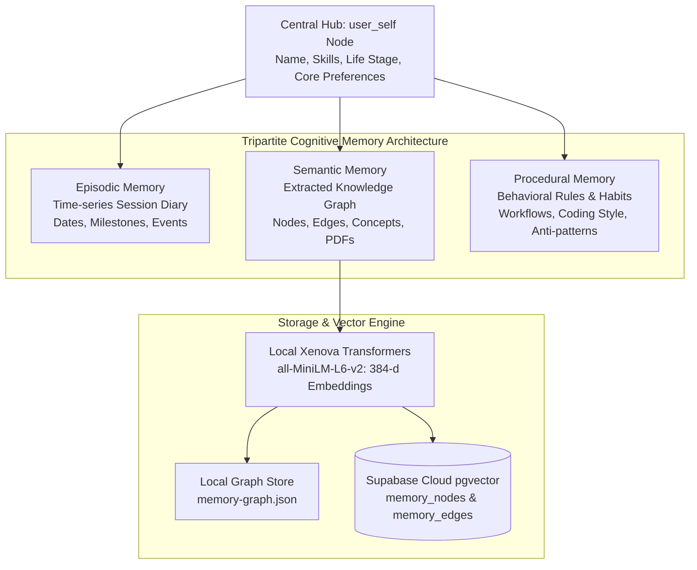
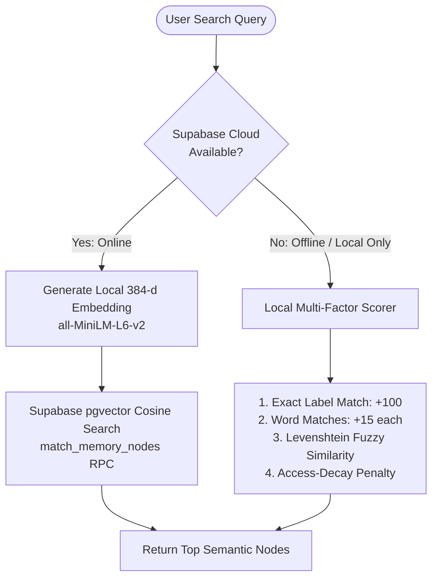

# Advanced Memory, Vector Embeddings & Knowledge Graph Architecture

**System:** Project Summer — Personal AI Assistant  
**Subsystem:** Memory Engine & Knowledge Layer  
**Implementation Directory:** `src/knowledge/` and `src/memory/`  
**Core Modules:** `embeddings.js`, `graph-store.js`, `graph-search.js`, `graph-context.js`, `graph-extractor.js`, `procedural-memory.js`, `session-diary.js`, `memory-consolidator.js`, `supabase_schema.sql`

---

## 1. Executive Summary & Vision

Traditional LLM assistants suffer from contextual amnesia: their memory is strictly confined to the tokens inside their active context window. Most RAG (Retrieval-Augmented Generation) implementations attempt to solve this by dumping raw conversation transcripts into a flat vector database, retrieving unstructured text chunks based on semantic similarity.

This naive approach fails for personal assistants:
* It confuses user identity with external topics.
* It lacks temporal awareness (cannot distinguish yesterday's plans from last year's).
* It does not learn behavioral habits or user corrections over time.

Summer implements an **Ego-Aware Knowledge Graph** coupled with **Dual-Path Vector & Fuzzy Retrieval**, creating a hierarchical persistent brain that learns continuously across episodic, semantic, and procedural domains.



---

## 2. The Ego-Aware Knowledge Graph Structure

Rather than a loose collection of documents, Summer's knowledge base is structured as a **Directed Acyclic Graph (DAG)** of interconnected nodes and edges.

### 2.1 The Central Anchor: `user_self`
At the topological center of the graph sits the `user_self` node. Every personal attribute branches out from this single root:
* **Identity:** Name, location, profession, life stage.
* **Technical Stack:** Node.js, Swift, Electron, Python, AI models.
* **Projects:** Direct edges to project entities (e.g., `user_self -[works_on]-> project_summer`).
* **Preferences:** Preferred coding style, tone, communication formats.

**Why this matters:** When searching memory, queries can traverse edges originating from `user_self`, completely eliminating hallucinations where Summer attributes facts about other people to the user.

### 2.2 Node Schema & Edge Relations
Defined in `supabase_schema.sql` and `src/knowledge/graph-store.js`:

```sql
CREATE TABLE memory_nodes (
    id TEXT PRIMARY KEY,
    type TEXT NOT NULL,           -- 'person', 'project', 'skill', 'preference', etc.
    label TEXT NOT NULL,          -- Short human-readable name
    description TEXT,             -- Detailed facts and context
    entities JSONB,               -- Named entities mentioned
    tags JSONB,                   -- Category tags (e.g. ['#work', '#coding'])
    pinned BOOLEAN DEFAULT FALSE, -- If true, always injected in System Prompt
    importance NUMERIC DEFAULT 0.5, -- Priority weight (0.0 to 1.0)
    updatedAt BIGINT,
    embedding vector(384)         -- High-dimensional semantic vector
);

CREATE TABLE memory_edges (
    id UUID PRIMARY KEY,
    "from" TEXT REFERENCES memory_nodes(id),
    "to" TEXT REFERENCES memory_nodes(id),
    label TEXT NOT NULL,          -- 'created', 'uses', 'dislikes', 'prefers'
    confidence NUMERIC DEFAULT 1.0
);
```

---

## 3. Tripartite Cognitive Memory Model

Summer categorizes all memories into three distinct cognitive systems:

### 3.1 Episodic Memory (`src/knowledge/session-diary.js`)
* **Purpose:** Represents Summer's autobiographical memory across time.
* **Mechanism:** At the conclusion of every conversation session, a background summarizer generates a narrative "Session Diary" entry.
* **Contextual Tagging:** Captures timestamp, session length, and physical location tags via `location-tagger.js`.
* **Emotional Continuity:** When a new session initializes, `graph-context.js` automatically injects the most recent diary entry into Gemini's setup prompt, allowing Summer to seamlessly acknowledge what was worked on previously.

### 3.2 Semantic Memory (`src/knowledge/graph-extractor.js`)
* **Purpose:** Declarative world and project knowledge.
* **Mechanism:** Ingestion pipelines process documents (PDFs, docs, notes) and spoken statements. Gemini extracts distinct entities and relationships, linking them into the graph.
* **Entity Resolution (`entity-resolution.js`):** Prevents duplicate nodes by normalizing IDs and calculating Levenshtein similarity before inserting new nodes.

### 3.3 Procedural Memory (`src/knowledge/procedural-memory.js`)
* **Purpose:** Behavioral patterns, coding rules, and user work styles.
* **Extraction Types:**
  * `style_preference`: *"Always use TypeScript strict mode."*
  * `workflow`: *"Run tests before compiling production builds."*
  * `anti_pattern`: *"Never use setTimeout in async workflows."*
  * `tool_preference`: *"Prefer Homebrew for package management."*
* **Confidence Lifecycle:**
  * Initial detection assigns confidence = `0.50`.
  * Each repeated reinforcement adds `+0.10` (capped at `0.99`).
  * Each contradiction subtracts `-0.20` (floored at `0.10`).
  * **Only rules with confidence ≥ 0.70** are promoted to active context injection.

---

## 4. Local Vector Extraction (`src/knowledge/embeddings.js`)

Summer eliminates reliance on external embedding APIs for memory indexing by running vector extraction **entirely locally on-device**.

### Technology: Transformers.js (`@xenova/transformers`)
* **Model:** `Xenova/all-MiniLM-L6-v2`
* **Vector Dimensions:** 384 floating-point numbers.
* **Execution:** Runs in Node.js via ONNX Runtime without requiring Python or GPU acceleration.
* **Normalization:** Embeddings are normalized with mean pooling:
  ```javascript
  const output = await extractor(text, { pooling: 'mean', normalize: true });
  return Array.from(output.data);
  ```

---

## 5. Dual-Path Semantic Retrieval (`src/knowledge/graph-search.js`)

Memory retrieval executes through an intelligent dual-path strategy:



### Path 1: Cloud Vector Search (Supabase `pgvector`)
When cloud sync is active, Summer generates a 384-dimensional embedding of the query and calls PostgreSQL's cosine similarity operator (`<=>`):
```sql
CREATE OR REPLACE FUNCTION match_memory_nodes (
  query_embedding vector(384),
  match_threshold float,
  match_count int,
  filter_tag text DEFAULT NULL
)
RETURNS TABLE (id text, similarity float)
LANGUAGE plpgsql AS $$
BEGIN
  RETURN QUERY
  SELECT memory_nodes.id, 1 - (memory_nodes.embedding <=> query_embedding) AS similarity
  FROM memory_nodes
  WHERE 1 - (memory_nodes.embedding <=> query_embedding) > match_threshold
  ORDER BY similarity DESC
  LIMIT match_count;
END;
$$;
```

### Path 2: Local Multi-Factor & Access-Decay Scorer
If offline or vector search fails, Summer falls back to a deterministic multi-factor scoring engine:
* **Exact ID / Label Match:** `+100` points.
* **Token Overlap:** Evaluates query words across node labels, descriptions, and tag arrays.
* **Fuzzy Match:** Calculates Levenshtein edit distance for spelling mistakes.
* **Access Decay Penalty (`getDecayScore`):** Nodes that have not been accessed in months receive a gradual decay penalty, ensuring fresh, actively relevant knowledge surfaces first.

---

## 6. Context Window Optimization & Importance Pinning

Injecting thousands of graph nodes into an LLM context window causes severe token bloat, latency spikes, and degraded attention. Summer solves this in `src/knowledge/graph-context.js`:

### Importance Thresholds
* **`PIN_THRESHOLD` (≥ 0.80) or `pinned === true`:**
  * Core identity facts (`user_self` attributes, critical health/allergies, primary active project).
  * **Always loaded into Gemini's System Prompt setup payload.**
* **Medium & Low Importance (< 0.80):**
  * **Completely omitted from the initial system instruction.**
  * The model is explicitly instructed:
    > *"You have a persistent memory graph of N additional facts. You CANNOT see them right now. You MUST call the `query_memory` tool before answering questions about past projects, people, or technical details."*

This hybrid architecture preserves a lightweight, zero-latency system prompt while giving Summer infinite memory capacity via on-demand tool execution.

---

## 7. Subconscious Memory Maintenance (`src/cortex/memory-consolidator.js`)

During idle periods, the Cortex Engine triggers automated graph maintenance:
1. **Deduplication:** Computes cosine similarity across all node pairs; clusters nodes with >0.88 similarity and merges them into unified entities.
2. **Island Bridging:** Identifies isolated graph clusters with no cross-edges and uses Gemini to find logical relationships connecting them.
3. **Decay Pruning:** Archives stale, low-importance nodes that have had zero reads for extended durations.
