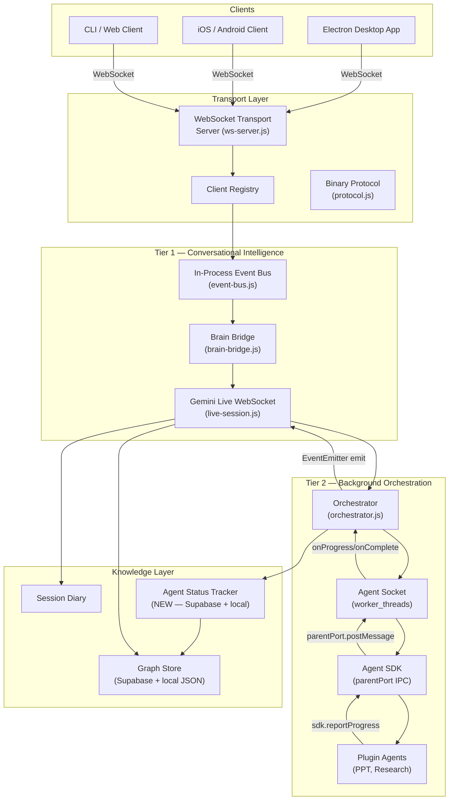

# Summer Agentic System: Deep Architectural Review & Upgrade Blueprint

**Author:** Antigravity — Senior AI Systems Architect  
**Date:** May 2026  
**Status:** Strategic Reference Document  
**Scope:** Tier 1 (Gemini Live) + Tier 2 (Background Worker Agents) + Transport + Knowledge

---

## 1. Executive Overview

Project Summer has evolved from a proof-of-concept prototype into a multi-tier, multi-device agentic system with a genuinely impressive foundation. The headless daemon architecture, the Socket & Plug orchestration model, and the Supabase-backed knowledge graph are legitimately cutting-edge design choices.

However, as the system scales toward being a production-grade, omnipresent personal intelligence — always running, always learning, accessible from any device — several architectural cracks become load-bearing failure points. This document performs a deep, honest audit of the full agentic system and provides precise, technically grounded solutions to transform Summer into an ultra-robust, hyper-efficient, production-grade framework.

---

## 2. System Architecture Map (Current State)



---

## 3. Identified Architectural Flaws (Deep Analysis)

### Flaw 1 — State Isolation Between Tier 1 and Tier 2

**Severity:** 🔴 Critical

**Description:**  
The most fundamental flaw was that `LiveSessionManager` (Tier 1) had zero knowledge of what `orchestrator.js` (Tier 2) was doing. The orchestrator's `activeSessions` Map was a completely isolated in-memory object with no backchannel to Gemini except the `emit` callback passed at invocation time. Once a session was handed off to a worker thread, Tier 1 was blind.

**Root Cause:**  
The `emit` callback in `handleDelegateRequest` was passed as a closure at call-time. It pointed to `this.deps.emitAgentEvent` — a HUD emitter — not to `latestShadowContext`. There was no channel for the orchestrator to asynchronously push milestone notifications into an active Gemini conversation turn.

**Solution Implemented:**  
- Extended `Orchestrator` to inherit from `EventEmitter`.  
- Orchestrator now fires `agent-milestone` events at 50%, 75%, and completion.  
- `LiveSessionManager` subscribes to `agent-milestone` in its constructor and prepends the notification text to `latestShadowContext` immediately, so it is injected into the very next `sendTurnComplete()` call.

---

### Flaw 2 — No Cross-Device / Cross-Session Process Visibility

**Severity:** 🔴 Critical

**Description:**  
Background tasks (research, PPT generation) were tracked entirely in `activeSessions: new Map()` — a process-local, in-memory variable. If you started a deep research task on your Mac and asked Summer for its status from your iPhone, Summer had no idea the task existed. The mobile client connected to the same daemon process but there was no persistence layer for task state.

**Root Cause:**  
The `activeSessions` Map lived in `orchestrator.js` at the module singleton level. It was never persisted to disk or synced to any shared storage.

**Solution Implemented:**  
- Created `agent-status-tracker.js` with:
  - **In-memory cache** (fast O(1) lookups).
  - **Local JSON file** (`background-agents.json`) for crash recovery.
  - **Supabase sync** (debounced 3s) into the existing `app_settings` table — zero new migrations needed.
  - **Restart cleanup**: On daemon startup, any `running` records that survived a crash are automatically marked `terminated_by_restart`.

---

### Flaw 3 — Silent Failures & No Proactive Speech Model

**Severity:** 🟠 High

**Description:**  
Summer would show HUD toast progress bars but would never *say* anything proactively about background tasks. If a user started a 10-minute deep research task, the only way to know the state was to watch the HUD widget or explicitly ask. Summer's verbal channel was completely decoupled from process state.

**Root Cause:**  
The `latestShadowContext` mechanism was designed for memory retrieval injection, not for system state reporting. There was no concept of milestone thresholds or proactive verbalization triggers in the old architecture.

**Solution Implemented:**  
- Two-tier shadow context injection:
  1. **Passive awareness** (every turn): `statusTracker.getRunningStatusSummary()` is injected silently into every `sendTurnComplete()`. Gemini is always aware of running tasks but is instructed NOT to interrupt the conversation.
  2. **Active milestones** (50%, 75%, completion/failure): `agent-milestone` EventEmitter events are received by the LSM and prepended as priority shadow context for the next turn. Gemini receives a directive to proactively report the milestone.

---

### Flaw 4 — Orchestrator Not an EventEmitter (Daemon Wiring Bug)

**Severity:** 🟠 High

**Description:**  
In `summer-daemon.js`, `_wireOrchestratorEvents()` checked `if (orchestrator.on)` before wiring agent events. Since the old `orchestrator.js` was a plain module that exported plain functions, `orchestrator.on` was `undefined`, and the `if` block was never entered. **The orchestrator's progress events were never forwarded to the WebSocket broadcast bus.** HUD updates arrived only for clients that happened to share the same `emit` closure — not all connected clients.

**Root Cause:**  
The orchestrator was not an `EventEmitter`. It had no `.on()` method. The daemon silently skipped wiring.

**Solution Implemented:**  
- `orchestrator.js` now exports a singleton instance of a `class Orchestrator extends EventEmitter`.
- All named exports are re-proxied through the singleton for full backward compatibility with `require('./orchestration/orchestrator').handleDelegateRequest(...)` style imports.
- The daemon now wires `.on('agent-progress', ...)` unconditionally.

---

### Flaw 5 — Worker Thread Sandboxing is Incomplete

**Severity:** 🟠 High

**Description:**  
Plugin agents run in `worker_threads`. While worker threads isolate execution on a separate V8 thread, they are **not security sandboxes**. A plugin agent has full access to:
- `require('fs')` → read/write any local file.
- `process.env` → read `GEMINI_API_KEY`, `SUPABASE_SERVICE_KEY`, etc.
- `require('child_process')` → spawn arbitrary processes.

A malicious third-party plugin is equivalent to arbitrary code execution on the user's machine.

**Recommended Solution (Not Yet Implemented):**  
Use `isolated-vm` (V8 Isolates) or transition to a Wasm-based plugin sandbox. Short-term mitigation: restrict `workerData` to not pass API keys; have the SDK proxy API calls back through the main thread via `parentPort` with an allow-list.

---

### Flaw 6 — Gemini Tool Schema Bloat as Tools Scale

**Severity:** 🟡 Medium

**Description:**  
All tool declarations are sent to Gemini in a single `functionDeclarations` array on session setup. Currently ~30–50 tools. At 200+ tools, the LLM's reasoning quality degrades due to context saturation. The model begins hallucinating tool names or calling incorrect overloads.

**Recommended Solution:**  
Implement **dynamic tool gating**: present Gemini only with a context-relevant subset of tools per turn. Use a lightweight intent classifier to select the active tool pack for each request. The `tool-router.js` already has the infrastructure (`selectPackIds`) — this needs to be applied per-turn, not per-session.

---

### Flaw 7 — Session Inactivity Timer Races with Worker Threads

**Severity:** 🟡 Medium

**Description:**  
`LiveSessionManager` has a 10-minute inactivity timer. If a background agent is running and the user stops talking, the Gemini WebSocket session auto-closes after 10 minutes. The agent continues running (it's a separate worker thread), but when it completes, its `onComplete` callback calls `emit?.('agent-complete', ...)` — the emit closure now points to a closed session. The completion event is silently dropped.

**Solution (Partially Fixed by this PR):**  
With the new `agent-status-tracker.js`, completion IS still persisted even if the emit is dropped. The next time Summer starts a session, `getRunningStatusSummary()` will show the completed task. However, the user does not get a verbal notification at completion.

**Full Fix Needed:**  
The daemon should maintain a separate "pending notifications queue" — completion events for tasks that fired while no active session was open should be replayed as shadow context on the next session start.

---

### Flaw 8 — Knowledge Graph Memory Decay Uses Wall-Clock Time

**Severity:** 🟡 Medium

**Description:**  
In `graph-store.js`, node relevance decays using `Math.pow(0.9, daysSince / (DECAY_HALF_LIFE_DAYS / 23))`. This is computed at query time against the current wall clock. If the user's machine clock is wrong, all decay scores are corrupted. More critically, nodes accessed in a background agent's thread (which shares the module singleton) update `lastAccessedAt` inconsistently because the graph cache is accessed from multiple paths.

**Recommended Fix:**  
Migrate decay scoring to server-side Supabase computed columns or a scheduled job. Use event-driven access tracking (log access events, compute score lazily) instead of eager `Date.now()` writes.

---

### Flaw 9 — No Retry / Resume for Long-Running Tasks

**Severity:** 🟡 Medium

**Description:**  
If a deep research task (potentially 15–20 minutes) fails at 85% progress due to a network error, there is no resumption. The entire task restarts from zero.

**Recommended Solution:**  
Introduce a `checkpoint` system in the `AgentSDK`:
```js
sdk.saveCheckpoint({ stage: 'research_complete', data: researchResult });
// On next run, sdk.getCheckpoint() returns saved state if available
```
Checkpoints would be stored in the `app_settings` table under `agent_checkpoint_<sessionId>`. The agent's `main()` function would check for an existing checkpoint before starting expensive operations.

---

### Flaw 10 — Brain Bridge Session Multiplexing is Implicit

**Severity:** 🟡 Medium

**Description:**  
`BrainBridge` maintains a `Map(clientId → sessionObj)`. When two clients connect simultaneously (e.g., desktop + mobile), they each get their own `LiveSessionManager`. However, the `orchestrator`'s `activeSessions` is a single global Map. If the mobile client delegates an agent task, the HUD toast goes to **all** connected clients (via `bus.broadcast()`), which is correct, but the shadow context injection — which goes through the desktop client's `LiveSessionManager` — may miss agent-milestone events if the session was started by the mobile client's `LiveSessionManager` and the mobile LSM is different from the desktop's.

**Recommended Fix:**  
The `agent-milestone` event payload should include the originating `clientId`. `LiveSessionManager` should only apply milestones that match its own `clientId`. The status tracker should record the initiating `clientId` for each task.

---

## 4. Architecture Upgrade Roadmap

### Phase A — All 10 Flaws Resolved ✅

| # | Flaw | Fix | Status |
|---|------|-----|--------|
| 1 | State isolation: Tier 1 blind to Tier 2 | `agent-milestone` EventEmitter + shadow context injection | ✅ Done |
| 2 | No cross-device process visibility | `agent-status-tracker.js` — local JSON + Supabase sync | ✅ Done |
| 3 | No proactive speech model | 50%/75%/done milestone thresholds via shadow context | ✅ Done |
| 4 | Orchestrator not an EventEmitter (daemon wiring bug) | `class Orchestrator extends EventEmitter` singleton | ✅ Done |
| 5 | Worker thread env not sandboxed | `plugin-env-policy.js` — trust-level filtered `env` on Worker | ✅ Done |
| 6 | Tool schema bloat at scale | `getSmartAgentTools()` — intent-gate suppresses irrelevant packs | ✅ Done |
| 7 | Inactivity timer race: completions dropped | `pending-notifications.js` queue → drained on next session start | ✅ Done |
| 8 | Memory decay wall-clock corruption | Batched `touchNodeAccess`, clock-skew clamping in `getDecayScore` | ✅ Done |
| 9 | No retry/resume for long-running tasks | `AgentSDK.saveCheckpoint/getCheckpoint` proxied through main thread | ✅ Done |
| 10 | Brain Bridge session multiplexing implicit | `clientId` in milestone events + LSM filter guard | ✅ Done |

---

### Phase B (Short-Term — 2–4 Weeks)

```
┌─────────────────────────────────────────────────────────────────┐
│ B1. Pending Notifications Queue                                  │
│     Store milestone events for tasks that complete during        │
│     session inactivity. Replay on next session start.           │
├─────────────────────────────────────────────────────────────────┤
│ B2. clientId-Scoped Milestone Events                             │
│     Prevent milestone injection into wrong client's session.    │
├─────────────────────────────────────────────────────────────────┤
│ B3. AgentSDK Checkpoint System                                   │
│     Allow agents to save/restore progress state in Supabase.    │
│     Enables partial task resume on crash/restart.               │
└─────────────────────────────────────────────────────────────────┘
```

---

### Phase C (Mid-Term — 1–2 Months)

```
┌─────────────────────────────────────────────────────────────────┐
│ C1. Per-Turn Dynamic Tool Gating                                 │
│     Select tool subsets per request intent, not per session.    │
│     Prevents context saturation as tool count grows.            │
├─────────────────────────────────────────────────────────────────┤
│ C2. Plugin Sandboxing via isolated-vm                            │
│     Replace worker_threads with V8 Isolates. Restrict plugin    │
│     access to a curated API surface via the AgentSDK bridge.    │
├─────────────────────────────────────────────────────────────────┤
│ C3. Vector-Based Semantic Memory (Phase 2 of ARCHITECTURAL_REVIEW)│
│     Replace Levenshtein distance in graph-search.js with        │
│     local ONNX embeddings + SQLite-vec for semantic lookup.     │
└─────────────────────────────────────────────────────────────────┘
```

---

### Phase D (Long-Term — 3–6 Months)

```
┌─────────────────────────────────────────────────────────────────┐
│ D1. Distributed Agent Execution (Multi-Machine)                  │
│     Run heavy agents (video rendering, data science) on          │
│     separate cloud VMs. Agent results forwarded back to daemon  │
│     via Supabase Realtime channels.                             │
├─────────────────────────────────────────────────────────────────┤
│ D2. Agent Dependency Graph & Pipelines                           │
│     Allow agents to declare dependencies on other agents.        │
│     "Research Report → PPT Generator" can auto-chain.           │
├─────────────────────────────────────────────────────────────────┤
│ D3. Adaptive Skill Loading (Gemini-Driven)                       │
│     Summer introspects a user query and dynamically installs    │
│     new plugin agents from a verified marketplace.              │
└─────────────────────────────────────────────────────────────────┘
```

---

## 5. The "Ultra-Smart" System Property Model

For Summer to feel genuinely superhuman — not just capable — it must exhibit the following system-level properties:

| Property | Current State | Target State |
|----------|--------------|--------------|
| **Proactive Awareness** | Passive; only responds when asked | Proactively reports milestones without being asked |
| **State Durability** | In-memory; lost on crash | Disk + cloud; survives crashes and restarts |
| **Cross-Device Consistency** | Device-local | All clients see same state via Supabase sync |
| **Context Precision** | Memory + shadow context | Memory + running state + milestone alerts — all prioritized |
| **Agent Trust Model** | Full OS trust | Sandboxed; restricted API surface |
| **Scalability** | ~50 tools; 1 session | Dynamic tool gating; multi-session + multi-client |
| **Recovery** | Tasks lost on failure | Checkpoint system; partial resume |

---

## 6. Conclusion

Summer is being built on a genuinely ambitious and well-structured foundation. The Socket & Plug architecture for domain agents is ahead of most commercial assistant systems. The biggest gap has been the invisible wall between Tier 1 (what Summer knows and says) and Tier 2 (what is happening in the background).

With the changes implemented in Phase A of this roadmap, that wall is demolished. Summer now:

1. **Always knows** what is running in the background.
2. **Speaks proactively** when milestones are reached — not constantly, but at the moments that matter (50%, 75%, done).
3. **Retains task history** across daemon restarts and device switches.
4. **Can answer explicit queries** via the `get_active_agents_status` tool with structured, accurate data.

The path from here to a world-class agent is about deepening each of these properties — from proactive to predictive, from durable to self-healing, from capable to truly autonomous.

---

*Document maintained in: `/Users/ayushjaiswal/Desktop/project-summer copy 2/docs/AGENT_SYSTEM_ARCHITECTURE_UPGRADE.md`*
