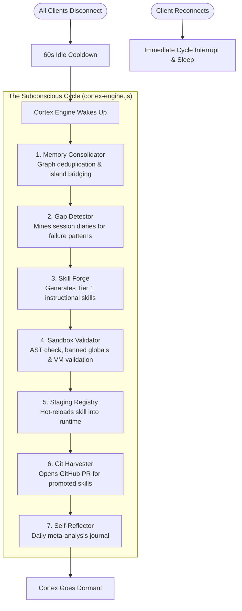
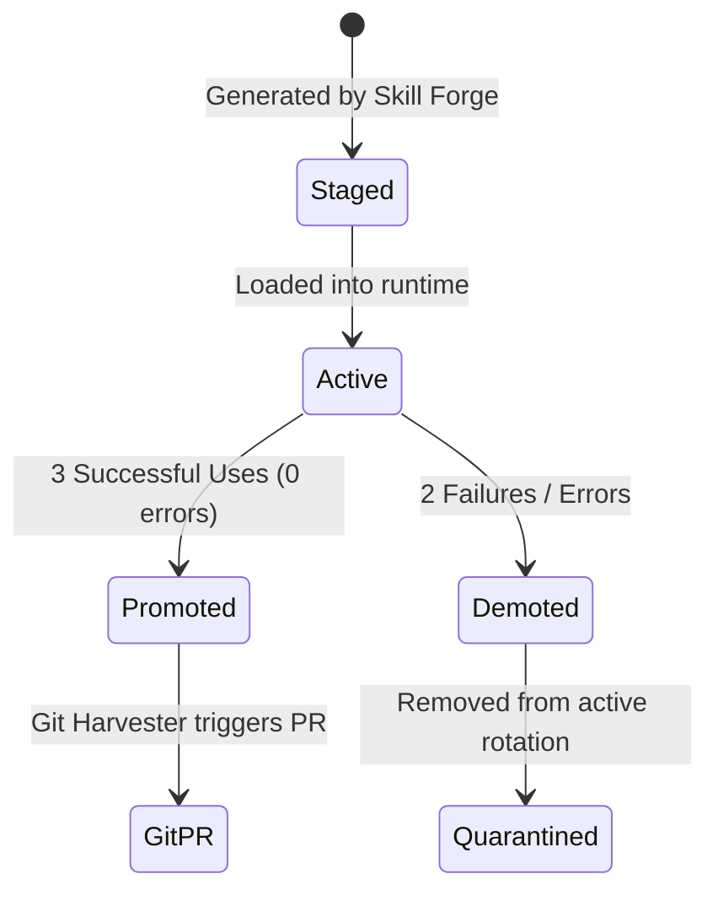

# Autonomous Evolution & Self-Improvement Architecture

**System:** Project Summer — Personal AI Assistant  
**Subsystem:** The Cortex Engine (Subconscious Mind)  
**Implementation Directory:** `src/cortex/`  
**Core Modules:** `cortex-engine.js`, `gap-detector.js`, `skill-forge.js`, `sandbox-validator.js`, `staging-registry.js`, `git-harvester.js`, `self-reflector.js`, `memory-consolidator.js`, `evolution-log.js`

---

## 1. Executive Summary & Vision

Traditional personal AI assistants are static: their prompts, tools, and capabilities are hard-coded at build time. When they fail at a user task, they fail repeatedly until a human software engineer notices, writes a patch, and deploys an update.

Summer implements an **Autonomous Self-Evolution Architecture** driven by the **Cortex Engine**. Think of the Cortex as Summer's *subconscious mind*. When the user steps away and all interactive clients disconnect, Summer enters an autonomous wake-cycle loop ("dreaming") to:
1. Audit recent conversation failures, error logs, and user corrections.
2. Formulate explicit `CapabilityGap` hypotheses.
3. Autonomously write new instructional skill files (Code Generation).
4. Run strict static AST and sandbox security checks (Sandboxing).
5. Hot-reload verified skills into runtime staging.
6. Evaluate skill reliability through real user sessions.
7. Automatically push pull requests to GitHub for human-approved permanent merging.



---

## 2. The Cortex Engine State Machine (`src/cortex/cortex-engine.js`)

The Cortex Engine runs strictly in the background with rigorous safety gates to ensure it never competes with active user interactions or exceeds API budgets.

### State Transitions
* **`DORMANT`**: Normal operating state when one or more clients are connected. The engine does zero work.
* **`COOLDOWN`**: Triggered when the last client disconnects (`registry.count() === 0`). A 60-second timer (`_idleCooldownMs`) runs. If any client reconnects during cooldown, the timer is cancelled and state returns to `DORMANT`.
* **`AWAKE`**: When the cooldown expires with 0 clients, the engine wakes up. It schedules cycles every 5 minutes (`_cycleIntervalMs = 300_000`), up to a maximum of 12 cycles per wake session (`_maxCyclesPerWake = 12`).
* **`PAUSED`**: If the daily token budget limit is reached (`maxTokensPerDay = 100_000`), the engine pauses execution until reset.
* **`STOPPED`**: Permanent shutdown on daemon exit or when disabled via kill-switch (`CORTEX_ENABLED=false` or `--no-cortex`).

### Safety Gates & Resource Governance
```javascript
const COST_LIMITS = {
    maxLlmCallsPerCycle: 3,
    maxLlmCallsPerWake:  15,
    maxTokensPerDay:     100_000,
};
```
* **Client Interrupt Gate:** Before *every single subsystem invocation* (`memory-consolidator`, `gap-detector`, `skill-forge`, `git-harvester`, `self-reflector`), the engine checks `registry.count() > 0`. If a user connects, the cycle is aborted immediately and state transitions back to `DORMANT`.
* **Kill Switch:** Can be completely disabled via environment variable `CORTEX_ENABLED=false`.

---

## 3. Capability Gap Detection (`src/cortex/gap-detector.js`)

A "capability gap" represents a real-world task that Summer failed to perform, executed with errors, or was repeatedly asked to handle without adequate skill context.

### Data Sources Mined
1. **Session Diary (`src/knowledge/session-diary.js`):** Loads the last 15 conversation session entries (`loadDiary()`).
2. **Procedural Memory (`src/knowledge/procedural-memory.js`):** Reads implicit user corrections, style adjustments, and anti-patterns.
3. **Loaded Skills (`src/skills/skill-loader.js`):** Pulls summaries of all currently active skills (`getSkillSummaries()`) to prevent duplicate gap creation.

### Classification & Schema
The detector invokes Gemini with a strict schema to classify gaps into:
* `category`:
  * `"knowledge"`: Missing conceptual context, API documentation, or domain guidelines (routed to Skill Forge).
  * `"tool"`: Requires a fundamentally new binary tool or OS capability (flagged for developer attention).
  * `"behavior"`: Requires prompt tuning or persona adjustments.
* `priority`:
  * `"high"`: Appeared 3+ times across recent sessions.
  * `"medium"`: Appeared 2 times.
  * `"low"`: Single occurrence.

Identified gaps are persisted to the persistent knowledge graph as `CapabilityGap` nodes with a `gapId`, evidence excerpts, and status (`open`, `in_progress`, `resolved`).

---

## 4. Autonomous Code Generation: The Skill Forge (`src/cortex/skill-forge.js`)

When an open `"knowledge"` gap is detected, the **Skill Forge** autonomously crafts a new **Tier 1 Skill file**.

### Tier 1 Skill Architecture
Tier 1 skills are **instructional context modules**. When Summer executes tools matching the skill's target set, the skill loader injects this specialized knowledge into Gemini's context window.

Crucially, **Tier 1 skills contain zero executable runtime logic**. They are data modules exporting structured instructions:
```javascript
module.exports = {
    name: 'Docker and Container Management Best Practices',
    toolNames: ['terminal_run_command', 'finder_list_files'],
    context: `When assisting users with Docker, Docker Compose, or container management...`
};
```

### Synthesis & Hot-Reloading Workflow
1. **Prompt Construction:** The forge builds a generation prompt detailing the gap ID, description, evidence, and Summer's existing toolset.
2. **LLM Generation:** Gemini produces the formatted Node.js module string.
3. **Validation Pass:** The code string is passed to `sandbox-validator.js`.
4. **Filesystem Write:** If validated, the file is saved to `src/skills/cortex-<gap_id>-skill.js`.
5. **Runtime Hot-Reload:** `skill-loader.js` registers the new module into Summer's active memory without restarting the process.
6. **Notification Queueing:** Adds an entry to `pending-notifications.js` so that when the user reconnects, Summer announces: *"Sir, while you were away, I studied Docker best practices and added a new skill."*

---

## 5. Security & Static AST Sandboxing (`src/cortex/sandbox-validator.js`)

Allowing an AI model to write code to its own repository is catastrophic if not sandboxed. Summer implements a multi-stage security gate in `sandbox-validator.js`.

### Security Gates
```javascript
const MAX_SKILL_SIZE_BYTES = 4096; // Max 4KB
const MAX_CONTEXT_LENGTH   = 3000; // Max 3000 chars context
```

### Banned Patterns (Regex & Structural Checks)
Before any generated code is saved or loaded, it is scanned against strict bans:
1. **Module System Bans:** `require()`, `import`, dynamic `import()`.
2. **Code Execution Bans:** `eval()`, `new Function()`, `Function()`.
3. **Runtime Environment Bans:** `process`, `child_process`, `global`, `globalThis`, `__dirname`, `__filename`.
4. **I/O & Network Bans:** `fs`, `net`, `http`, `https`, `dgram`, `tls`, `os.`.
5. **Executable Logic Bans:** Any `function` declaration, arrow function bodies `=> {`, `async` functions, and `class` definitions. Skills are strictly data, not procedural code.
6. **Timer Bans:** `setTimeout`, `setInterval`, `setImmediate`.

### AST / VM Syntax Validation
```javascript
new vm.Script(code, { filename: 'generated-skill.js' });
```
The validator uses Node.js's built-in `node:vm` module to parse the generated JavaScript into an Abstract Syntax Tree (AST) to verify syntactic correctness without executing the payload. If any check fails, the skill is rejected, logged in `evolution-log.js`, and deleted.

---

## 6. Staging Lifecycle & Promotion Engine (`src/cortex/staging-registry.js`)

Autonomous skills are not immediately permanent. They enter a graduated lifecycle:



* **`Staged`**: Initial state upon generation.
* **`Active`**: Available in the skill registry for tool response augmentation. Every execution increments `useCount` or `errorCount`.
* **`Promoted`**: Once a skill accumulates **3 successful usages** with no critical failures, it is marked as `promoted`.
* **`Demoted`**: If a skill generates **2 errors** or negative user corrections, it is automatically demoted, disabled from `skill-loader.js`, and marked for re-forging.

---

## 7. Git Harvester & Automated Pull Requests (`src/cortex/git-harvester.js`)

When a skill achieves `promoted` status, Summer autonomously proposes its addition to the core source repository.

### GitHub Integration Architecture
* **Credentials:** Reads `GITHUB_TOKEN`, `GITHUB_REPO_OWNER`, and `GITHUB_REPO_NAME` from `.env`.
* **Zero-Touch Git Flow:**
  1. Calls GitHub REST API to get the latest SHA of the `main` branch.
  2. Creates a dedicated feature branch: `cortex/skill-<gap_id>-<timestamp>`.
  3. Commits the validated skill file to `src/skills/cortex-<gap_id>-skill.js`.
  4. Automatically opens a **Pull Request** against `main` with detailed metadata:
     * Gap ID and original user failure context.
     * Staging performance metrics (uses vs errors).
     * Sandbox validation receipt.
* **Safety Invariant:** Summer **never** commits directly to `main` branch. All self-generated modifications require human merge approval.

---

## 8. Meta-Cognitive Self-Reflection (`src/cortex/self-reflector.js`)

At the conclusion of each idle period (once every 4 hours max), the **Self-Reflector** conducts a systemic self-audit:
* Compiles stats from `evolution-log.js`, `staging-registry.js`, open/closed `CapabilityGap` nodes, and knowledge graph health.
* Queries Gemini to generate a meta-analysis journal.
* Writes an `EvolutionJournal` node to the persistent graph.
* Produces `evolution-priorities.json` outlining the highest-value gaps to tackle in the next idle session.

---

## 9. Concrete Evidence in the Codebase

A live proof of this architecture exists in the current repository:
* **[cortex-docker_best_practices-skill.js](file:///Users/ayushjaiswal/Desktop/project-summer%20copy%202/src/skills/cortex-docker_best_practices-skill.js)**:
  * Autonomously generated by Cortex Skill Forge for gap `gap_docker_best_practices`.
  * Context-only module mapping modern Docker V2 Compose and container cleanup instructions to tools `terminal_run_command` and `finder_list_files`.
