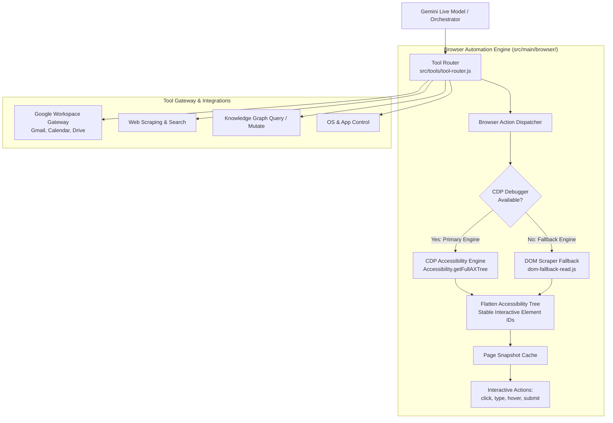

# Browser Automation & Tool Calling Architecture

**System:** Project Summer — Personal AI Assistant  
**Subsystem:** Browser Automation & Tool Gateway Layer  
**Implementation Directory:** `src/main/browser/`, `src/tools/`, `src/services/`  
**Core Modules:** `browser-automation.js`, `element-resolver.js`, `dom-fallback-read.js`, `browser-session.js`, `tool-router.js`, `browser-tool-declarations.js`, `google-tools.js`, `drive-service.js`

---

## 1. Executive Summary & Vision

To execute real-world tasks, an assistant must not merely search the web for text snippets; it must interact with dynamic web applications—navigating portals, filling forms, clicking checkout buttons, and extracting visual data.

Traditional browser automation tools (like raw Puppeteer or Selenium) struggle when driven by conversational LLMs because modern Single Page Applications (SPAs built with React, Vue, or Next.js) constantly re-render DOM trees, invalidating injected IDs and class selectors.

Summer solves this with a **Dual-Engine Browser Architecture** combining **CDP (Chrome DevTools Protocol) Accessibility Tree Extraction** with a fallback DOM parser, integrated into an extensible **Function Calling Tool Gateway**.



---

## 2. CDP-Powered Browser Automation (`src/main/browser/browser-automation.js`)

Summer operates a native mini-browser inside an Electron `webContents` instance (`src/browser/browser.html`). When the assistant needs to read or interact with a webpage, it drives the page via the **Chrome DevTools Protocol (CDP)**.

### Solving the SPA Fragility Problem
Older automation scripts injected temporary HTML attributes (e.g. `data-ai-id="4"`) into web elements. Whenever a React or Vue component re-rendered its state, these attributes vanished, causing subsequent `click` actions to fail.

Summer bypasses the raw DOM by interrogating Chrome's internal **Accessibility Tree**:
```javascript
async function readViaAx(wc) {
    await ensureDebugger(wc);
    const { nodes } = await wc.debugger.sendCommand('Accessibility.getFullAXTree');
    // Flattens AX tree into stable numbered list of interactive elements
    return flattenAxTree(nodes);
}
```

### Why the Accessibility Tree is Superior
1. **Immune to CSS/DOM Re-renders:** The accessibility tree models semantic roles (`button`, `link`, `textbox`, `combobox`) rather than fleeting DOM div structures.
2. **True Visually Interactive Elements:** Automatically filters out invisible layout divs, off-screen nodes, and hidden overlays, exposing only actionable elements.
3. **Shadow DOM Transparency:** Deeply inspects web components and Shadow DOM boundaries that standard query selectors fail to penetrate.

---

## 3. Interactive Browser Tool Pipeline

Summer exposes a declarative set of browser tools defined in `src/tools/browser-tool-declarations.js`:

```
browser_navigate(url) -> browser_read() -> [browser_click | browser_type | browser_hover | browser_submit]
```

### 1. `browser_navigate`
Navigates the visible mini-browser to the target URL and waits for page load events (`did-finish-load`, `networkidle`).

### 2. `browser_read`
Captures the current state of the page and returns a numbered list of all actionable elements:
```
[1] [Link] "Sign In" (href="/login")
[2] [TextBox] "Email Address" (placeholder="name@company.com")
[3] [TextBox] "Password"
[4] [Button] "Continue"
[5] [Link] "Forgot Password?"
```
This snapshot is cached in memory for subsequent actions.

### 3. `browser_click(elementId)`
Resolves `elementId` against the cached accessibility snapshot and dispatches synthetic mouse events directly to the target element's center coordinates:
```javascript
await wc.debugger.sendCommand('Input.dispatchMouseEvent', {
    type: 'mousePressed',
    x: element.x,
    y: element.y,
    button: 'left',
    clickCount: 1,
});
```

### 4. `browser_type(elementId, text, append)`
Focuses the target text field, optionally clears existing content, and sends native keystroke events simulating natural user typing.

### 5. `browser_hover(elementId)`
Moves the virtual pointer to trigger CSS `:hover` states, revealing nested dropdown navigation menus or tooltip previews.

### 6. `browser_submit(elementId)`
Triggers form submission and automatically invokes `waitForSettle(wc)` to await AJAX requests, navigation, or DOM mutations before returning control to the assistant.

---

## 4. DOM Fallback Engine (`src/main/browser/dom-fallback-read.js`)

If the Chrome DevTools debugger is unavailable or cannot attach (e.g., cross-origin security restrictions), Summer seamlessly falls back to `dom-fallback-read.js`:
* Injects a deterministic JavaScript reader into the `webContents`.
* Computes computed styles (`getComputedStyle`), visibility bounds (`getBoundingClientRect`), and assigns hierarchical indices to interactive HTML elements (`<button>`, `<a>`, `<input>`, `<select>`, `[role="button"]`).
* Ensures zero disruption to the user's automated workflow.

---

## 5. Tool Calling Gateway Architecture (`src/tools/tool-router.js`)

Summer features a centralized **Tool Gateway** that routes conversational function calls from Gemini Live to their respective domain handlers.

### Declaration Schema
All tools are defined using standard OpenAPI JSON schemas (e.g. `src/tools/browser-tool-declarations.js`, `os-tool-declarations.js`, `google-tool-declarations.js`):
```javascript
{
    name: "browser_click",
    description: "Click an interactive element on the page by its number. You MUST call browser_read first to get element numbers.",
    parameters: {
        type: "OBJECT",
        properties: {
            elementId: { type: "STRING", description: "The element number from browser_read, e.g. '3'" }
        },
        required: ["elementId"]
    }
}
```

### Central Router Dispatch Loop
When Gemini emits a function call payload over the WebSocket, `tool-router.js` handles parameter validation, context injection, and error formatting:

```javascript
async function executeTool(toolName, args, context = {}) {
    try {
        if (toolName.startsWith('browser_')) {
            return await executeBrowserTool(toolName, args);
        } else if (toolName.startsWith('os_')) {
            return await executeOsTool(toolName, args, context);
        } else if (toolName.startsWith('google_')) {
            return await executeGoogleTool(toolName, args, context);
        } else if (toolName === 'delegate_domain_agent') {
            return await orchestrator.handleDelegateRequest(args);
        }
        // ...
    } catch (error) {
        return { error: `Tool execution failed: ${error.message}` };
    }
}
```

---

## 6. Google Workspace & Cloud Integrations

Summer features deep integrations with Google Workspace, managed via multi-account OAuth in `src/auth/google-auth.js`:

### 1. Multi-Account Gmail (`src/services/mail-service.js`)
* Supports concurrent personal and work Google accounts.
* Lists, searches, and drafts emails with attachments and rich formatting.

### 2. Google Calendar
* Synchronizes schedules, creates meetings, and provides conversational agenda briefings.

### 3. Google Drive Media Presentation (`src/services/drive-service.js`)
* Lists and searches files across cloud drives.
* **Drive Presentation & Rendering:** Seamlessly streams Drive PDFs, slides, and images directly into the HUD's mini-browser and visual cards, parsing textual content in the background.
