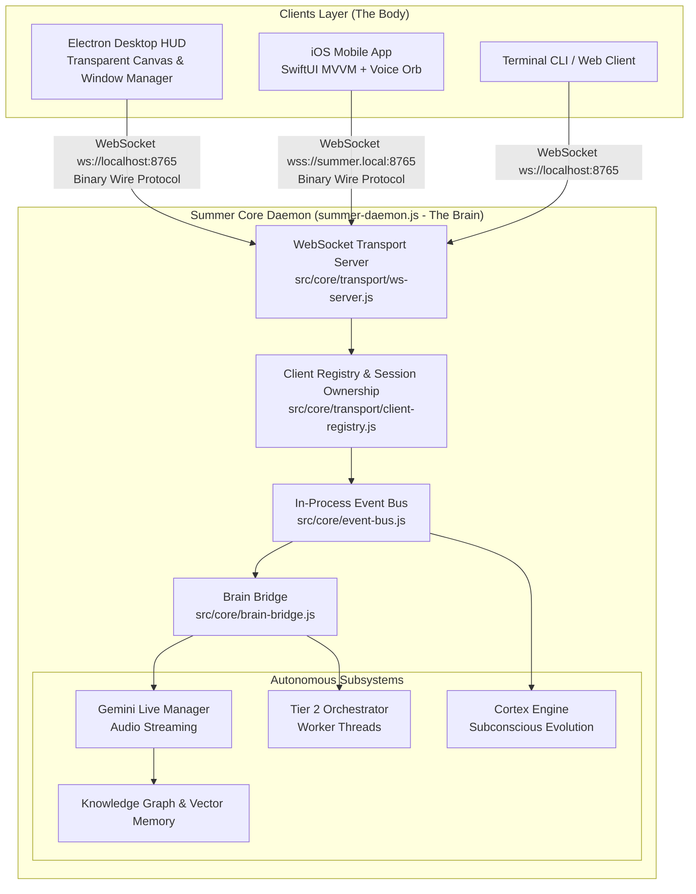

# Headless Daemon & Transport Protocol Architecture

**System:** Project Summer — Personal AI Assistant  
**Subsystem:** Core Headless Daemon & Cross-Platform Wire Protocol  
**Implementation Directory:** `src/core/transport/`, `src/core/platform/`, root  
**Core Modules:** `summer-daemon.js`, `ws-server.js`, `protocol.js`, `client-registry.js`, `event-bus.js`, `brain-bridge.js`

---

## 1. Executive Summary & Vision

Many personal AI assistants are fundamentally constrained because their entire intelligence is trapped inside a desktop GUI framework (like Electron). When the user closes their laptop or steps away from their desk, the assistant ceases to exist—it cannot monitor background tasks, run scheduled research, or converse via a mobile device.

Summer solves this by decoupling the **Brain** from the **Body**:
* **The Brain (Summer Daemon):** A standalone, headless Node.js daemon (`summer-daemon.js`) with **zero Electron dependencies**. It runs 24/7 on macOS, Linux cloud servers, or local home servers.
* **The Transport Protocol:** A high-performance WebSocket wire protocol (`src/core/transport/protocol.js`) that defines a strict contract for all client interactions.
* **The Clients:** Thin presentation frontends—Electron Desktop HUD, native iOS SwiftUI app, Android client, or headless CLI—that connect to the daemon over local network or secure WebSockets.



---

## 2. The Core Daemon Architecture (`summer-daemon.js`)

The daemon is the persistent heartbeat of Project Summer. It can be launched automatically as an Electron child process or deployed independently as a `systemd` or `launchd` background service.

### CLI Launch Flags
```bash
node summer-daemon.js                 # Default production daemon (port 8765)
node summer-daemon.js --port=9000     # Custom WebSocket listening port
node summer-daemon.js --skip-auth     # Development mode (bypasses auth tokens)
node summer-daemon.js --no-wake-word  # Disables local mic listener (cloud/server mode)
node summer-daemon.js --no-cortex     # Disables autonomous background self-evolution
```

### Daemon Lifecycle Boot Sequence
1. **Platform Detection (`adapter-factory.js`):** Instantiates the proper OS adapter (`adapter-macos.js` or `adapter-base.js`).
2. **Knowledge Base Warmup:** Loads local JSON graphs, connects to Supabase `pgvector`, and primes the Session Diary cache.
3. **Agent Status Synchronization:** Wakes `agent-status-tracker.js` to restore any persistent task states across devices.
4. **WebSocket Server Binding:** Binds `ws-server.js` to `0.0.0.0:8765`, enabling both local and LAN connections.
5. **Brain Bridge Wiring:** Couples incoming WebSocket messages to `LiveSessionManager` and `orchestrator.js`.
6. **Subconscious Cortex Activation:** If enabled and no clients are actively connected, the Cortex Engine begins idle cooldown.

---

## 3. The Summer Wire Protocol (`src/core/transport/protocol.js`)

All communication crossing the WebSocket boundary strictly adheres to the **Summer Wire Protocol**. 
* **Convention:** Messages sent **from Client to Daemon** start with verbs (`start_`, `send_`, `cancel_`).
* **Convention:** Messages sent **from Daemon to Client** start with nouns or states (`session_`, `audio_`, `hud_`, `agent_`).

### 3.1 Client → Daemon Message Specification

| Message Type (`MSG`) | Payload Structure | Functional Purpose |
| :--- | :--- | :--- |
| `client_hello` | `{ clientId, deviceName, platform, token }` | Handshake; registers client capabilities with daemon. |
| `start_session` | `{ mode: 'audio' \| 'text', context? }` | Starts an active Gemini Live conversational session. |
| `stop_session` | `{ reason? }` | Gracefully closes active session and triggers diary synthesis. |
| `send_audio` | `{ data: base64PCM, sampleRate: 16000 }` | Streams real-time 16kHz microphone audio frames. |
| `send_turn_complete` | `{}` | VAD silence trigger or push-to-talk button release. |
| `send_text` | `{ text: string }` | Sends typed text prompt instead of audio. |
| `permission_response` | `{ requestId, granted: bool, alwaysAllow: bool }` | Response to dangerous OS action authorization request. |
| `cancel_agents` | `{ reason? }` | User clicked abort or said "stop"; terminates active worker threads. |
| `client_action_result`| `{ requestId, action, result, error? }` | Result of delegated Mac OS actions executed by desktop client. |
| `ping` | `{ timestamp }` | Liveness keepalive frame. |

### 3.2 Daemon → Client Message Specification

| Message Type (`MSG`) | Payload Structure | Functional Purpose |
| :--- | :--- | :--- |
| `daemon_hello` | `{ serverVersion, platform, authenticated: bool }` | Handshake acknowledgment. |
| `session_started` | `{ sessionId, model, sampleRate: 24000 }` | Signals Gemini setup complete; client prepares speaker. |
| `audio_response` | `{ data: base64PCM, sampleRate: 24000 }` | Synthesized AI speech chunks for speaker playback. |
| `text_response` | `{ text: string, role: 'agent' }` | Markdown or raw text of Summer's response. |
| `agent_interrupted` | `{}` | Barge-in trigger: client must instantly flush speaker buffer. |
| `tool_call` | `{ name, args, callId }` | Informs client that Summer is invoking a specific tool. |
| `hud_update` | `{ widgetId, type, data, zone }` | Renders visual widget natively on client screen. |
| `hud_clear` | `{ widgetId? }` | Removes expired or dismissed widgets from the display. |
| `permission_request` | `{ requestId, toolName, description, buttons }` | Displays interactive authorization dialog to user. |
| `agent_progress` | `{ sessionId, agentId, percent, message }` | Live progress updates from Tier 2 background workers. |
| `agent_complete` | `{ sessionId, agentId, result }` | Task completion with generated artifacts/HTML dashboards. |
| `session_ownership` | `{ isOwner: bool, ownerDeviceName }` | Manages single-speaker ownership across multiple connected devices. |

---

## 4. Multi-Client Coordination & Session Ownership (`src/core/transport/client-registry.js`)

A single Summer daemon can serve multiple connected devices simultaneously (e.g., an iPhone in the user's hand and a MacBook on their desk).

### Client Tracking
`client-registry.js` tracks each connected socket:
* `clientId`: Unique UUID per device connection.
* `platform`: `'darwin'`, `'ios'`, `'android'`, or `'linux'`.
* `capabilities`: Flags indicating whether the client has audio input, audio output, screen rendering, or OS shell execution.

### Single-Speaker Session Ownership
To prevent race conditions where audio input from an iPhone clashes with audio input from a Mac:
1. When a client issues `start_session`, `ClientRegistry` assigns it exclusive **Session Ownership**.
2. Other connected clients receive a `session_ownership` notification (`isOwner: false, ownerDeviceName: "Ayush's iPhone"`).
3. Secondary clients can still display HUD progress, mirror transcripts, or view generated research reports in real-time, but only the active owner streams audio.

---

## 5. In-Process Event Bus Architecture (`src/core/event-bus.js`)

Internally, the daemon is fully decoupled using an EventEmitter-based event bus. Modules never import each other cyclically; they emit and consume standard events:

```javascript
const bus = require('./src/core/event-bus');

// Subsystems communicate via standard event constants:
bus.EVENTS = {
    CLIENT_CONNECTED:      'client_connected',
    CLIENT_DISCONNECTED:   'client_disconnected',
    SESSION_START:         'session_start',
    SESSION_END:           'session_end',
    AGENT_STARTED:         'agent_started',
    AGENT_PROGRESS:        'agent_progress',
    AGENT_COMPLETE:        'agent_complete',
    PERMISSION_RESPONSE:   'permission_response',
    CORTEX_AWAKE:          'cortex_awake',
    CORTEX_SLEEP:          'cortex_sleep',
};
```

This clean architecture ensures that adding new capabilities (such as Home Assistant, smart home nodes, or new mobile clients) requires zero modifications to Summer's core LLM reasoning engine.
