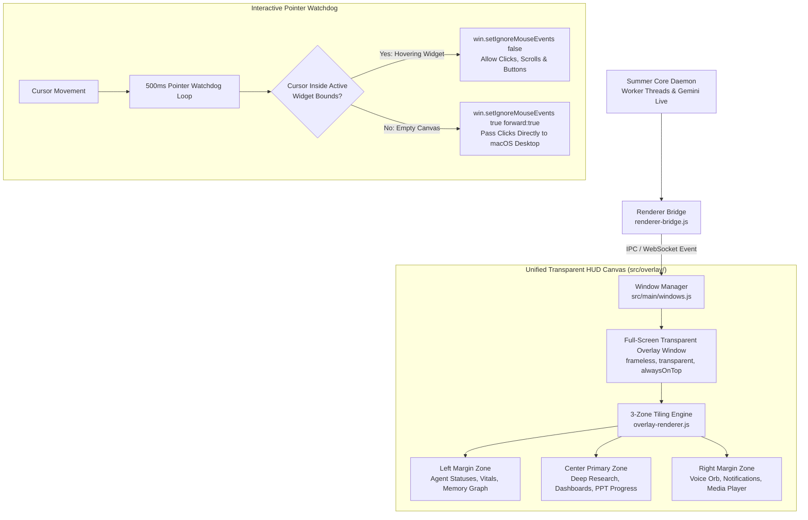

# Holographic HUD & Frontend UI Architecture

**System:** Project Summer — Personal AI Assistant  
**Subsystem:** Holographic Desktop HUD, Transparent Overlay & Window Management  
**Implementation Directory:** `src/overlay/`, `src/hud-panel/`, `src/orb/`, `src/main/`  
**Core Modules:** `overlay-renderer.js`, `overlay.css`, `windows.js`, `window-manager.js`, `renderer-bridge.js`

---

## 1. Executive Summary & Vision

Traditional AI assistants live inside rectangular chat boxes. They demand that the user switch away from their active work (code editor, browser, terminal) to converse with the AI.

Summer rejects this paradigm in favor of an **Ambient Holographic Heads-Up Display (HUD)** inspired by Iron Man's Jarvis. 
* The assistant is an omnipresent, transparent visual layer floating subtly over macOS.
* It presents critical information (deep research findings, code diffs, news cards, system diagnostics) without obscuring the desktop.
* Crucially, users can click, scroll, and type in underlying macOS applications directly through Summer's overlay, with mouse interactivity engaging seamlessly only when hovering over active Summer widgets.



---

## 2. The Unified Transparent Canvas Architecture

In earlier prototypes, Summer spawned separate individual floating Electron windows for each widget (one for the voice orb, one for subtitles, one for research). This caused severe desktop clutter, OS window-focus fighting, and window management race conditions.

Summer v2 consolidates everything into a **Single Unified Transparent Canvas**:
* **Window Specifications (`src/main/windows.js`):**
  ```javascript
  const overlayWindow = new BrowserWindow({
      x: primaryDisplay.bounds.x,
      y: primaryDisplay.bounds.y,
      width: primaryDisplay.bounds.width,
      height: primaryDisplay.bounds.height,
      transparent: true,
      frame: false,
      hasShadow: false,
      alwaysOnTop: true,
      skipTaskbar: true,
      webPreferences: {
          preload: path.join(__dirname, '../overlay/overlay-preload.js'),
          contextIsolation: true,
      }
  });
  ```
* Covers 100% of the active display with a GPU-accelerated transparent HTML5 canvas.
* All cards, notifications, and animations are managed by a single DOM renderer (`overlay-renderer.js`), eliminating window spawn latency.

---

## 3. The Content-Aware 3-Zone Tiling Engine

The overlay employs a deterministic, spatial layout algorithm that dynamically arranges content to preserve maximum visible desktop workspace:

```
┌─────────────────┬──────────────────────────────────┬─────────────────┐
│   LEFT ZONE     │          CENTER ZONE             │   RIGHT ZONE    │
│ (System & Vitals)│       (Primary Focus Work)       │ (Ambient Orbit) │
│                 │                                  │                 │
│ • Active Agents │ • Deep Research Comprehensive     │ • Holographic   │
│ • Memory Previews│   Reports & Markdown Dashboards  │   Voice Orb     │
│ • CPU / RAM     │ • PPT Generation Slides          │ • Audio Waves   │
│ • Wi-Fi Status  │ • Rich HTML Interactive Widgets  │ • Transient     │
│                 │ • Mini-Browser Webpage Inspector │   Toast Alerts  │
└─────────────────┴──────────────────────────────────┴─────────────────┘
```

### 1. Center Zone (Primary Focus)
* Reserved for high-cognitive tasks requested by the user.
* Features responsive maximum width (up to 900px), glassmorphic styling, and scrollable containers.
* Dismissible via an explicit close button or conversational voice command (*"Summer, clear the screen"*).

### 2. Left Zone (Persistent Background State)
* Displays real-time progress bars for active Tier 2 Domain Agents (e.g. Deep Research at 65%).
* Renders quick-access cards for recently retrieved memory graph nodes and session diaries.

### 3. Right Zone (Ambient Telemetry)
* Anchors the floating holographic voice orb and Web Audio frequency visualizer.
* Renders transient toasts (timers firing, incoming emails, quick confirmations) that fade out automatically after 8 seconds.

---

## 4. The Real-Time Pointer Watchdog (OS Click-Through)

The greatest technical hurdle for full-screen desktop overlays is ensuring the user can still click buttons, select text, and use applications (like VS Code or Safari) running *underneath* the overlay.

Summer implements an active **Pointer Watchdog** in `src/main/windows.js` and `overlay-renderer.js`:

```javascript
// Default state on startup:
overlayWindow.setIgnoreMouseEvents(true, { forward: true });
```
With `forward: true`, macOS delivers mouse clicks directly to whatever native window is behind the overlay.

### Dynamic Interaction Re-engagement
1. The overlay renderer maintains an internal registry of bounding boxes for all active visible widgets.
2. An event loop samples cursor position:
   ```javascript
   function updateMouseIgnorance(cursorX, cursorY) {
       const isHoveringWidget = activeWidgets.some(widget => {
           const rect = widget.getBoundingClientRect();
           return cursorX >= rect.left && cursorX <= rect.right &&
                  cursorY >= rect.top  && cursorY <= rect.bottom;
       });
       
       if (isHoveringWidget && isIgnoringMouse) {
           // User wants to interact with a Summer widget
           ipcRenderer.send('set-ignore-mouse-events', false);
           isIgnoringMouse = false;
       } else if (!isHoveringWidget && !isIgnoringMouse) {
           // User moved mouse back over macOS desktop
           ipcRenderer.send('set-ignore-mouse-events', true, { forward: true });
           isIgnoringMouse = true;
       }
   }
   ```
3. When hovering over a Summer widget, buttons, scrollbars, and links become fully interactive. As soon as the cursor leaves the card, click-through to the operating system is restored instantly.

---

## 5. Supported Widget Renderers

The HUD ships with specialized native component renderers:

| Widget Type | Emitted By | Visual Presentation & Behavior |
| :--- | :--- | :--- |
| **`custom_html`** | Orchestrator / Domain Agents | Sandboxed rich HTML dashboards with glassmorphic cards and interactive buttons. |
| **`research_report`** | `research_analyst` plugin | Full markdown parsing with code syntax highlighting, embedded base64 chart visuals, and PDF export buttons. |
| **`image_gallery`** | `show_visual_memory` / `search_images` | High-resolution horizontal carousel with image expansion and face-tag overlays. |
| **`agent_progress`** | `AgentSocket` / Orchestrator | Glowing progress bar, milestone stage descriptions, and an interactive **Abort / Cancel** button. |
| **`news_briefing`** | `news_monitor` plugin | Card grid with sentiment tags (Bullish/Bearish/Neutral), headline summaries, and source links. |
| **`mini_browser`** | `browser_navigate` tool | Embedded webview displaying live webpage automation with element numbering overlays. |

---

## 6. Renderer Bridge (`src/core/utils/renderer-bridge.js`)

Because Summer's core logic can run headlessly or inside background worker threads, modules do not write directly to the DOM. Instead, they publish through `rendererBridge`:
* If running inside **Electron**, it dispatches directly via `ipcRenderer.send` or `webContents.send`.
* If running as a **Headless Daemon**, it encodes the payload as a `hud_update` frame and broadcasts it over the WebSocket transport to all connected desktop clients.
