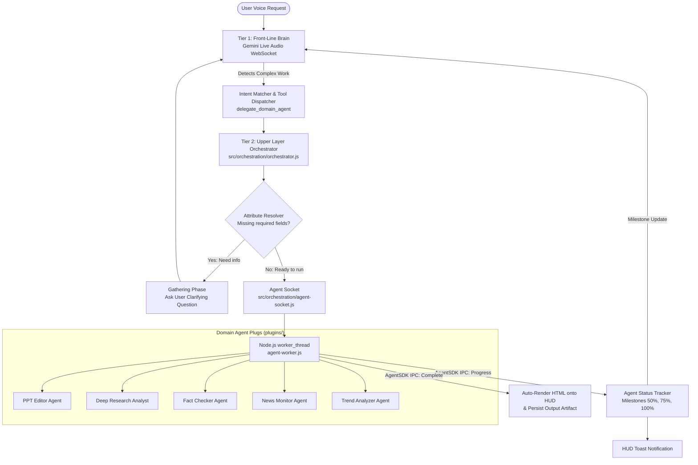

# Multi-Agent Orchestration & Background Worker Architecture

**System:** Project Summer — Personal AI Assistant  
**Subsystem:** Tier 2 Orchestration & Domain Agent Plugs  
**Implementation Directory:** `src/orchestration/` and `plugins/`  
**Core Modules:** `orchestrator.js`, `agent-socket.js`, `agent-worker.js`, `agent-status-tracker.js`, `attribute-resolver.js`, `intent-matcher.js`, `plugin-env-policy.js`, `plugin-registry.js`, `packages/agent-sdk/index.js`

---

## 1. Executive Summary & Vision

Single-agent AI systems suffer from a severe architectural limitation: the same LLM session is expected to handle real-time voice latency, maintain conversational personality, remember user context, and simultaneously perform deep, long-running tasks like multi-page research or complex document generation.

When an assistant attempts to do everything in one thread:
* Audio stutter and websocket timeouts occur during heavy computation.
* Context windows fill with raw data, degrading conversational ability.
* Long-running tasks are lost if the user disconnects or the UI crashes.

Summer solves this by splitting its intelligence into a **Two-Tier Orchestration Architecture**:
* **Tier 1 (The Front-Line Brain / Chief of Staff):** Gemini Live WebSocket session (`src/main/gemini/live-session.js` / `src/core/brain-bridge.js`). Handles conversational voice, instant tool execution, and intent routing.
* **Tier 2 (The Upper Layer Orchestrator & Worker Sockets):** Manages headless, asynchronous background worker agents that execute isolated workloads in dedicated Node.js `worker_threads`.



---

## 2. The Socket & Plug Modular Ecosystem

Summer acts as an intelligent motherboard. Specialized capabilities are not hardcoded into the core assistant; they are standalone **Plugs** loaded into **Sockets** at runtime.

### The Agent Manifest (`skill.json`)
Every domain agent in `plugins/<plugin_name>/` must expose a declarative `skill.json` manifest:

```json
{
  "agent_id": "ppt_editor_v1",
  "display_name": "PPT Editor",
  "description": "Generates PowerPoint presentations from topic, audience, and content data.",
  "socket_type": "background_worker",
  "entry_point": "index.js",
  "mandatory_attributes": [
    { "key": "topic", "type": "string", "description": "Main subject of the presentation." },
    { "key": "slide_count", "type": "number", "description": "Target number of slides." },
    { "key": "target_audience", "type": "string", "description": "Who the presentation is for." },
    { "key": "context_data", "type": "string", "description": "All relevant background info." }
  ],
  "optional_attributes": [
    { "key": "color_theme", "type": "string", "default": "modern-dark" }
  ],
  "resource_limits": {
    "max_execution_time_seconds": 600
  }
}
```

The Orchestrator reads these manifests on startup (`loadPluginManifests()`) and automatically injects available plug descriptions into Gemini's system prompt.

---

## 3. Intelligent Intent Routing & Attribute Resolution

When a user request arrives (e.g., *"Make a 10-slide presentation about Quantum Computing for high school students"*), Summer executes a two-phase resolution:

### Phase 1: Intent Matching (`src/orchestration/intent-matcher.js`)
* Analyzes the user's spoken request against registered plugin triggers and keyword heuristics.
* Maps requests to the proper agent plug (e.g., `ppt_editor_v1`, `research_analyst_v2`, `fact_checker_v1`).

### Phase 2: Attribute Resolution (`src/orchestration/attribute-resolver.js`)
* Inspects the agent's `mandatory_attributes`.
* Extracts provided attributes from the natural language prompt and previous conversation turns.
* **If attributes are missing (`!ready`):**
  * The session enters the `gathering` phase.
  * Summer formulates a targeted clarification question (e.g., *"How many slides would you like for the Quantum Computing deck?"*).
  * Stashes partial attributes in `activeSessions`.
* **When all mandatory attributes are present (`ready === true`):**
  * Launches the worker socket immediately.

---

## 4. Isolated Execution: Agent Socket (`src/orchestration/agent-socket.js`)

To guarantee system stability, domain agents execute outside the main Node.js thread using `node:worker_threads`.

### Sandboxing & Environment Policy (`src/orchestration/plugin-env-policy.js`)
Worker threads do not inherit the host process's full environment. `plugin-env-policy.js` sanitizes and filters `process.env`:
* Removes sensitive operating system tokens and internal secrets.
* Whitelists only required credentials for that specific plugin (e.g., `GEMINI_API_KEY` for Research, `GOOGLE_WORKSPACE_*` for Drive uploads).

### Timeout & Process Supervision
* `AgentSocket` applies a strict watchdog timer based on the manifest's `max_execution_time_seconds`.
* If a worker hangs or enters an infinite loop, `socket.kill('timeout')` fires, terminating the worker thread cleanly.

---

## 5. The Agent SDK & Checkpoint Resumption (`packages/agent-sdk/index.js`)

Domain agents communicate with the Orchestrator via the lightweight `AgentSDK` using Node.js thread IPC (`parentPort`).

### Progress & Milestone Streaming
```javascript
sdk.reportProgress(percent, message);
```
1. Worker sends progress payload over IPC.
2. `Orchestrator` receives the update and pushes a UI notification event to the holographic HUD.
3. `agent-status-tracker.js` intercepts the progress. When major milestones (50%, 75%, 100%) are crossed, it generates a milestone announcement event that is injected into Tier 1's shadow context so Summer can proactively update the user verbally if appropriate.

### Task Checkpointing & Disaster Recovery
Heavy background jobs (e.g., 20-minute recursive web research) must survive accidental disconnects. The SDK implements a disk-persisted checkpoint system:

```javascript
// Check for existing checkpoint
const cp = await sdk.getCheckpoint('after_research');
if (cp) {
    sdk.reportProgress(80, 'Resuming from saved research checkpoint...');
    return formatAndSave(cp.researchResult, cp.topic, sdk);
}

// Perform work and persist checkpoint
await sdk.saveCheckpoint('after_research', { researchResult, topic });
```

* **IPC Proxying:** Because workers are sandboxed and lack unrestricted filesystem access, `saveCheckpoint` sends a `resource_request` to the main thread.
* The main thread writes the checkpoint to `{userData}/agent-checkpoints/{agentId}_{checkpointKey}.json`.
* If the task crashes or is interrupted, the agent can resume from the last completed stage instead of re-running costly API calls.
* Checkpoints are automatically cleared upon task `complete`.

---

## 6. Real-Time HUD Rendering & Cancellation

### Direct HTML Auto-Rendering
Many domain agents generate rich visual artifacts (e.g., Research reports, News dashboards, Trend momentum charts). 
* When `sdk.complete(result)` returns an `html` property, `orchestrator.js` immediately forwards the payload to `renderer-bridge.js`.
* The holographic HUD displays the rendered visual widget on screen instantly, without waiting for the conversational model to make a separate UI tool call.

### Global Cancellation Workflow
Users retain total control over long-running background tasks:
1. **HUD Interaction:** Every active agent tile on the HUD displays an interactive **Abort / Cancel** button.
2. **Voice Stop Interception:** If the user speaks *"Summer, stop the research"* or *"Cancel current agents"*, `orchestrator.cancelIfUserSaysStop()` intercepts the utterance and calls `socket.kill('user_cancel')`.
3. The underlying `Worker` thread is destroyed immediately, releasing memory and CPU resources.

---

## 7. Integrated Domain Agents

The codebase ships with five fully realized domain agent plugins in `plugins/`:

| Agent ID | Display Name | Core Technology | Primary Output |
| :--- | :--- | :--- | :--- |
| **`ppt_editor_v1`** | PPT Editor | Layout engine + PptxGenJS | Native `.pptx` presentation file |
| **`research_analyst_v2`** | Deep Research Analyst | Native Gemini Interactions API (`deep-research-preview-04-2026`) + Playwright | Comprehensive Markdown, PDF report, and Google Drive upload |
| **`fact_checker_v1`** | Fact Checker | Playwright web scraper + Multi-source cross-reference | Verification confidence matrix & source citations |
| **`news_monitor_v1`** | News Monitor | Google News RSS + Sentiment Analysis + Gemini Vision | Live news briefing card & sentiment trends |
| **`trend_analyzer_v1`** | Trend Analyzer | Market keyword momentum & trend metrics | Interactive HTML trend momentum dashboard |
