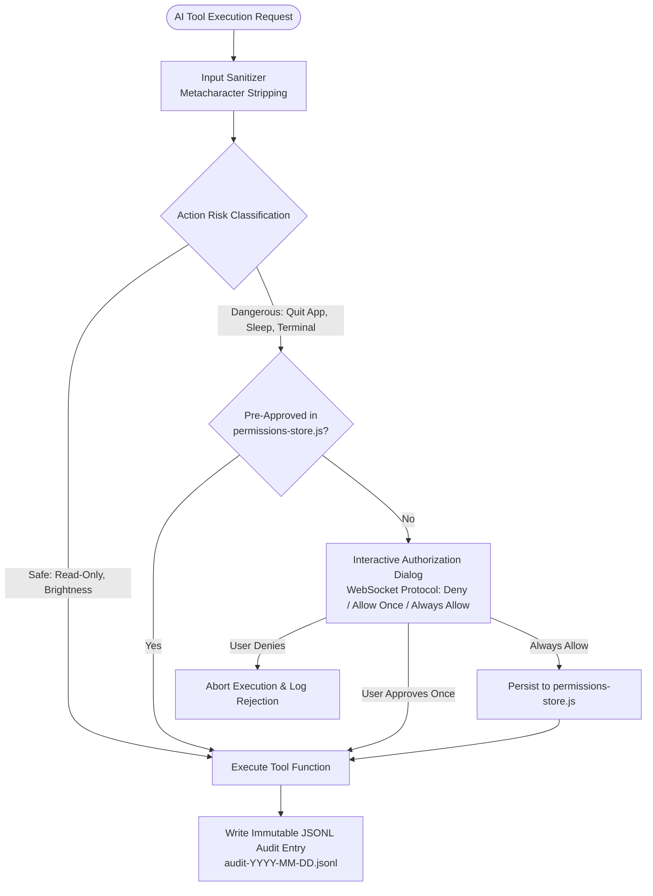

# Security, Privacy & Permissions Architecture

**System:** Project Summer — Personal AI Assistant  
**Subsystem:** Security Boundary, Permission Engine & Data Privacy  
**Implementation Directory:** `src/settings/`, `src/tools/`, `src/cortex/`, `src/orchestration/`  
**Core Modules:** `permissions-store.js`, `os-tools.js`, `sandbox-validator.js`, `plugin-env-policy.js`, `audit-logs`

---

## 1. Executive Summary & Vision

Granting an AI system deep access to operating system controls, local files, shell commands, and browser automation presents serious security risks. An unconstrained autonomous agent can accidentally delete user files, execute malicious code, or leak sensitive credentials to external APIs.

Project Summer implements a **Multi-Layer Zero-Trust Security Architecture** ensuring:
1. **Tiered Permissions & Explicit User Confirmation:** Dangerous actions cannot execute without user authorization.
2. **Deterministic Code Sandboxing:** Autonomous code generated by the Cortex Engine cannot execute arbitrary system calls.
3. **Worker Thread Credential Isolation:** Domain plugins only receive explicitly whitelisted environment variables.
4. **Immutable Audit Trails:** Every tool call and OS modification is logged persistently to disk.
5. **Local-First Privacy Sovereignty:** Audio feature extraction, wake words, and vector embeddings run entirely on-device.



---

## 2. Tiered Permission Matrix & Interactive Confirmation

Actions in Summer are strictly categorized based on their potential to alter system state or destroy data:

### Classification Matrix

| Risk Level | Operations | Security Enforcement |
| :--- | :--- | :--- |
| **SAFE** | • `os_get_system_info`, `os_get_volume`<br>• `os_set_brightness`, `os_toggle_dark_mode`<br>• `os_open_app`, `os_focus_app`<br>• `query_memory`, `search_web` | Executes immediately with input sanitization. |
| **DANGEROUS** | • `os_quit_app`<br>• `os_system_sleep`, `os_lock_screen`<br>• `os_empty_trash`, `finder_trash_file`<br>• `terminal_run_command`<br>• `whatsapp_send_message` | **Requires explicit user confirmation** via interactive dialog. |

### The WebSocket Confirmation Flow (`confirmDangerousAction`)
When a dangerous tool is invoked:
1. Summer checks `permissions-store.js` to see if the user previously granted permanent permission.
2. If not pre-approved, `os-tools.js` dispatches a `permission_request` frame across the WebSocket protocol.
3. The active client (Electron overlay, mobile app, or terminal) displays an interactive prompt:
   * **Deny:** Cancels execution immediately.
   * **Allow Once:** Authorizes the single action without saving state.
   * **Always Allow:** Grants permanent permission, storing the entry in `permissions-store.json`.
4. If no response is received within a 30-second timeout, the action is safely aborted.

---

## 3. Immutable Persistent Audit Trail

Every OS interaction is logged to daily append-only JSONL files located at `{userData}/audit-logs/audit-YYYY-MM-DD.jsonl`.

### Audit Log Entry Schema
```json
{
  "timestamp": "2026-10-08T16:34:12.804Z",
  "action": "os_quit_app",
  "args": { "appName": "Safari" },
  "result": "Quit Safari.",
  "approved": true
}
```

* **Non-Repudiation:** Every action—whether approved, denied by user, or failed due to system errors—is recorded with a timestamp and parameters.
* **Traceability:** Users can review the exact command history at any time to verify what Summer performed during automated or background tasks.

---

## 4. Autonomous Code Sandboxing (`src/cortex/sandbox-validator.js`)

Summer's self-evolution capability allows it to write new skill files. To prevent the AI from generating destructive or compromised software updates, `sandbox-validator.js` enforces strict static AST gates:

### Prohibited Patterns
Generated skills are scanned against comprehensive bans:
* **No File or Network I/O:** Complete prohibition of `fs`, `net`, `http`, `https`, `tls`, `dgram`, `os.`.
* **No Process Execution:** Complete prohibition of `child_process`, `process`, `exec`, `spawn`.
* **No Dynamic Evaluation:** Complete prohibition of `eval()`, `new Function()`, `Function()`.
* **No Imports / Exports of Code:** Prohibits `require()`, `import`, and function definitions.
* **Skills as Pure Data:** Skills must be strictly instructional context objects exporting `name`, `toolNames`, and `context`.

### AST Node.js VM Verification
```javascript
new vm.Script(code, { filename: 'generated-skill.js' });
```
Uses Node.js's native `node:vm` to compile and parse the source code into an Abstract Syntax Tree without executing it. If any syntax error or banned token is discovered, the file is rejected and purged immediately.

---

## 5. Worker Thread Environment Sandboxing (`plugin-env-policy.js`)

Domain agents execute inside Node.js `worker_threads`. By default, Node.js workers inherit the parent process's entire `process.env`, which could expose database credentials, cloud keys, and system secrets to third-party or autonomous plugins.

Summer enforces strict **Environment Scrubbing**:
```javascript
const PLUGIN_ENV_WHITELIST = {
    'ppt_editor_v1':       [],
    'research_analyst_v2': ['GEMINI_API_KEY', 'GOOGLE_WORKSPACE_ACCESS_TOKEN'],
    'fact_checker_v1':     ['PLAYWRIGHT_HEADLESS'],
};

function buildPluginEnv(manifest) {
    const allowedKeys = PLUGIN_ENV_WHITELIST[manifest.agent_id] || [];
    const sanitizedEnv = {};
    for (const key of allowedKeys) {
        if (process.env[key]) sanitizedEnv[key] = process.env[key];
    }
    return sanitizedEnv;
}
```
Any environment variable not explicitly enumerated in the whitelist is completely masked from the worker thread.

---

## 6. Data Privacy & Sovereign AI Operations

Summer is designed with a **Local-First Privacy Philosophy**:

### 1. On-Device Acoustic & Vector Inference
* **Wake Word:** Processed locally using ONNX Runtime (`onnxruntime-node`). Raw continuous audio is never streamed to external servers while waiting for a wake phrase.
* **Vector Embeddings:** Generated locally using `Xenova/all-MiniLM-L6-v2` (`@xenova/transformers`). Semantic indexing of personal memory occurs on the local CPU without transmitting queries to third-party embedding providers.

### 2. Knowledge Graph Sovereignty
* Memory graphs and session diaries are stored in local JSON caches on disk.
* Cloud synchronization with Supabase is completely optional, protected by encrypted connections and PostgreSQL Row-Level Security (RLS).
* The user retains 100% ownership of their memory data, which can be exported, modified, or permanently deleted via local files or conversational commands.
