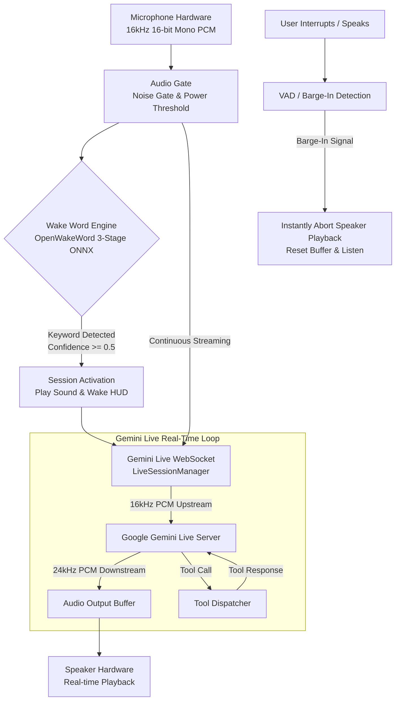
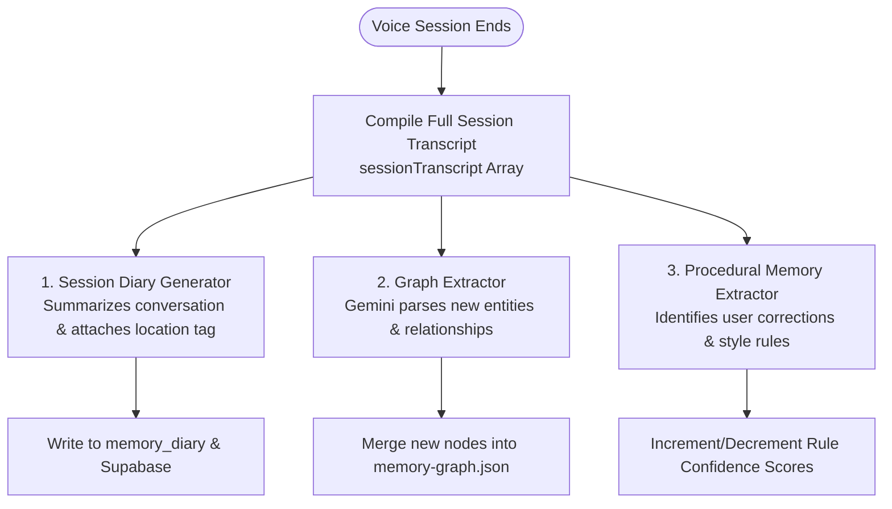

# Voice Pipeline & Real-Time Audio Streaming Architecture

**System:** Project Summer — Personal AI Assistant  
**Subsystem:** Audio Pipeline, Wake Word Detection & Gemini Live Streaming  
**Implementation Directory:** `src/wake-word/`, `src/main/gemini/`, `src/core/`, `src/orb/`  
**Core Modules:** `wake-word-engine.js`, `mic-listener.js`, `audio-gate.js`, `live-session.js`, `visualizer.js`, `protocol.js`

---

## 1. Executive Summary & Vision

A world-class personal AI assistant must achieve instantaneous conversational fluidity. If an assistant takes 3 seconds to process a sentence or cannot be interrupted when speaking, the illusion of an intelligent companion breaks down.

Summer implements a **Zero-Latency Real-Time Audio Pipeline** combining:
1. **On-Device 3-Stage ONNX Wake Word Detection:** Listens continuously for the activation phrase with minimal CPU footprint.
2. **Bidirectional Full-Duplex PCM Streaming:** Connects directly to Google's **Gemini Live WebSocket API**, streaming 16kHz PCM audio upstream and receiving 24kHz PCM audio downstream.
3. **Hardware-Level Voice Activity Detection (VAD) & Barge-In:** Enables natural user interruptions—cutting off the AI's synthesized voice mid-syllable the moment the user starts speaking.
4. **Post-Session Subconscious Memory Extraction:** Transcribes and parses spoken sessions for automatic knowledge graph ingestion and diary compilation.



---

## 2. On-Device 3-Stage ONNX Wake Word Engine (`src/wake-word/wake-word-engine.js`)

Summer does not send continuous audio to the cloud to detect wake words. Instead, it runs an optimized **OpenWakeWord ONNX pipeline** locally in Node.js via `onnxruntime-node`.

### The 3-Stage Pipeline
Audio is processed in chunks of **1280 PCM samples (80ms at 16kHz)**:

1. **Stage 1: Mel-Spectrogram Extraction (`melspectrogram.onnx`)**
   * Input: 1280 raw 16-bit PCM audio samples.
   * Output: Shape `[1, 1, 5, 32]` (5 rows of 32 mel-frequency bins).
2. **Stage 2: Audio Embedding Model (`embedding_model.onnx`)**
   * Input: 76 stacked mel rows (representing an ~1200ms temporal window).
   * Output: Shape `[1, 1, 1, 96]` (a 96-dimensional high-level acoustic embedding).
3. **Stage 3: Classifier Head (`hey_jarvis_v0.1.onnx`)**
   * Input: 16 stacked 96-dimensional embeddings (representing a rolling 1.28s window).
   * Output: Shape `[1, 1]` confidence score between `0.0` and `1.0`.

### Thresholding & Temporal Smoothing
* **Activation Threshold:** Default `threshold = 0.50`.
* **Temporal Smoothing:** Computes a rolling median over recent chunk scores to prevent false triggers from transient background noise.
* **Cooldown & Debounce:** Enforces a 2000ms cooldown after activation to prevent immediate re-triggering while Summer is greeting the user.

---

## 3. Bidirectional Gemini Live WebSocket Streaming (`src/main/gemini/live-session.js`)

When activated, Summer establishes an authenticated full-duplex WebSocket connection to Google's Gemini Live endpoint.

### Audio Format Standards
* **Input (Client → Gemini):** `audio/pcm;rate=16000` (16-bit signed, little-endian, mono).
* **Output (Gemini → Client):** `audio/pcm;rate=24000` (24kHz high-fidelity speech synthesis).

### Handshake & Context Payload
On WebSocket connection open, Summer sends a `setup` configuration payload:
1. **Model:** `gemini-2.0-flash-exp` (or `gemini-3.1-flash`).
2. **System Instruction:** Built dynamically by `graph-context.js`:
   * High-priority pinned facts (`importance >= 0.8`).
   * Personal ego-aware node (`user_self`).
   * Previous session summary from the Session Diary for continuity.
   * Procedural behavioral rules (`confidence >= 0.7`).
   * Available Tier 2 Domain Agent manifests (`skill.json`).
3. **Tools Declaration:** Comprehensive OpenAPI schemas for OS tools, browser automation, memory queries, and agent orchestration.

---

## 4. Voice Activity Detection (VAD) & Barge-In Interruption

One of the most frustrating aspects of traditional voice assistants is their inability to be interrupted when speaking. Summer implements instant **Barge-In Handling**:

### Interruption Detection
1. While Summer's speakers are playing audio, the microphone listener continues sampling background audio through `audio-gate.js`.
2. When the user speaks, the client or Gemini Live server detects incoming user voice packets.
3. Gemini immediately emits an `interrupted: true` or `barge_in` control frame.

### Instant Audio Teardown
When the interruption frame arrives:
```javascript
// In src/main/gemini/live-session.js
handleBargeIn() {
    // 1. Dispatch interrupt event to transport protocol
    bus.dispatch(bus.EVENTS.AGENT_INTERRUPTED);
    
    // 2. Instruct renderer / speaker to flush buffer immediately
    sendToRenderer('flush-audio-playback');
    
    // 3. Clear pending audio queue
    this._audioPlaybackQueue.length = 0;
}
```
The speaker drops playback within ~50ms, the holographic voice orb pulses to indicate listening, and Summer smoothly pivots to the user's new request.

---

## 5. Visual Feedback: The Voice Orb & Visualizer (`src/visualizer.js`)

Summer features a dynamic holographic visualizer inspired by Jarvis:
* **Audio Frequency Sampling:** A Web Audio API `AnalyserNode` computes real-time FFT frequency spectrums.
* **State-Based Morphing:**
  * *Idle / Sleep:* Gentle, slow breathing glow.
  * *Listening:* High-frequency responsive orb that ripples with the user's vocal cadence.
  * *Thinking / Reasoning:* Orbital rotation with pulsating color gradients.
  * *Speaking:* Rhythmic waveform expansion coupled to the synthesized audio output.
  * *Executing Tool / Background Agent:* Split orbital rings indicating active sub-tasks.

---

## 6. Post-Session Asynchronous Extraction Loop

When a voice conversation concludes, Summer does not discard the dialogue. The raw transcript triggers an asynchronous background extraction pipeline:



This guarantees that every verbal interaction directly enhances Summer's long-term intelligence for future sessions.
